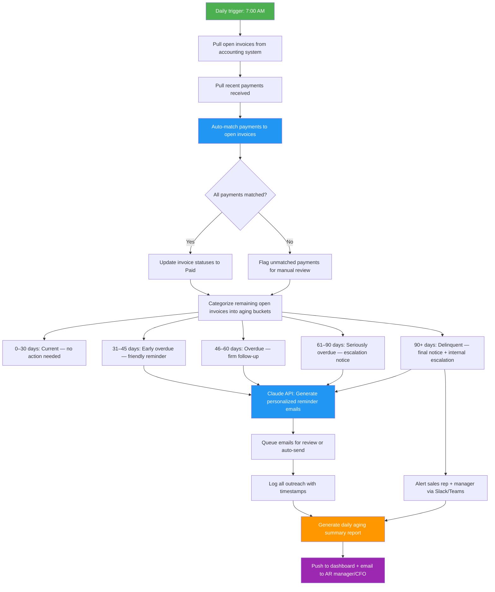

# Blueprint: Accounts Receivable Specialist — Automated Aging Report & Payment Follow-Up Tracker

**Role:** Accounts Receivable Specialist, Collections Coordinator, Small Business Finance Admin  
**Pain Point:** 10–15 hours/week manually tracking overdue invoices, generating aging reports, composing follow-up emails, reconciling incoming payments, and escalating delinquent accounts  
**Time Saved:** ~10–12 hours/week  
**Difficulty to Implement:** Low–Medium  
**Tools Required:** Accounting system (QuickBooks, Xero, FreshBooks, or CSV exports), Email (Gmail/Outlook), Claude API or any LLM API, Python or Zapier/Make, Google Sheets or database, optional Slack/Teams for internal alerts  

---

## The Problem

In every business that invoices customers — from a 10-person agency to a 500-employee distributor — someone is stuck in a painful daily loop: they open the accounting system, pull a list of who owes what, mentally sort through dozens or hundreds of open invoices trying to figure out which ones are 30 days late versus 90 days late, decide who gets a gentle nudge versus a stern final notice, compose individual emails (often re-typing the same template with different numbers), log their outreach, check whether any payments came in overnight, match those payments to the correct invoices, and then update leadership on the state of collections.

For a company with 100–500 open invoices at any given time, this work eats 10–15 hours per week. The real damage goes beyond labor cost: when follow-ups slip through the cracks, cash sits in customers' bank accounts instead of yours. Industry data shows that the probability of collecting an invoice drops from 95% at 30 days overdue to below 70% at 90 days, and to roughly 50% at 120 days. Every week of delayed follow-up costs real money. The average small business has $84,000 in outstanding receivables at any time, and studies show that systematic, timely follow-up reduces DSO (Days Sales Outstanding) by 15–25%.

This blueprint builds an automated pipeline that pulls open invoice data daily, categorizes every invoice into aging buckets, generates personalized follow-up communications at the right tone and urgency, tracks payment receipts, and produces a daily executive-ready aging summary — catching at-risk accounts before they become write-offs.

---

## Workflow Overview



---

## Why This Should Be Implemented

### The Business Case

| Metric | Before Automation | After Automation |
|--------|-------------------|------------------|
| Hours/week on AR follow-up | 10–15 hours | 1–2 hours (review only) |
| Average DSO (Days Sales Outstanding) | 45–65 days | 30–45 days |
| Invoices that reach 90+ days overdue | 8–12% | 2–4% |
| Follow-up emails sent per week | 30–50 (manual) | 100–200 (automated) |
| Payment collection rate at 60 days | 80% | 92%+ |
| Bad debt write-offs per year | 2–5% of revenue | < 1% of revenue |
| Time to generate aging report | 45–90 minutes | Instant (auto-generated) |

### Who Benefits

- **AR Specialists / Collections Coordinators** stop composing repetitive emails and focus on high-value negotiation with truly difficult accounts
- **CFOs / Controllers** get a clean daily snapshot of cash position, risk exposure, and collection trends without asking for it
- **Sales Reps** get automatic alerts when their customers fall behind, so they can intervene before the relationship sours
- **Business Owners** improve cash flow predictability and reduce the capital trapped in receivables
- **Customers** get consistent, professional communication that makes it easy to pay — no more invoices that fall through the cracks on both sides

---

## Detailed Implementation

### Step 1: Pull Open Invoices and Recent Payments

**Trigger:** Scheduled daily at 7:00 AM (cron job or automation platform)

The system connects to your accounting software and pulls two datasets: all open/unpaid invoices and all payments received in the last 24 hours.

```python
import requests
import csv
import json
from datetime import datetime, timedelta
from pathlib import Path
from dataclasses import dataclass, field

@dataclass
class Invoice:
    """Represents an open invoice."""
    invoice_id: str
    customer_name: str
    customer_email: str
    amount: float
    amount_paid: float
    balance_due: float
    issue_date: str
    due_date: str
    days_overdue: int
    sales_rep: str = ""
    notes: str = ""
    last_follow_up: str = ""
    follow_up_count: int = 0

@dataclass
class Payment:
    """Represents an incoming payment."""
    payment_id: str
    customer_name: str
    amount: float
    date: str
    reference: str = ""
    matched_invoice: str = ""

class ARDataPipeline:
    """Pulls open invoices and payments from accounting system."""

    def __init__(self, config: dict):
        self.config = config
        self.today = datetime.now()

    def pull_open_invoices_from_quickbooks(self) -> list[Invoice]:
        """
        Pull open invoices via QuickBooks API.
        Replace with your accounting system's API or CSV export.
        """
        # QuickBooks Online API example
        headers = {
            "Authorization": f"Bearer {self.config['access_token']}",
            "Accept": "application/json"
        }
        query = "SELECT * FROM Invoice WHERE Balance > '0'"
        url = (
            f"https://quickbooks.api.intuit.com/v3/company/"
            f"{self.config['company_id']}/query?query={query}"
        )
        response = requests.get(url, headers=headers)
        raw_invoices = response.json().get("QueryResponse", {}).get("Invoice", [])

        invoices = []
        for inv in raw_invoices:
            due_date = datetime.strptime(inv["DueDate"], "%Y-%m-%d")
            days_overdue = max(0, (self.today - due_date).days)
            invoices.append(Invoice(
                invoice_id=inv["DocNumber"],
                customer_name=inv["CustomerRef"]["name"],
                customer_email=inv.get("BillEmail", {}).get("Address", ""),
                amount=float(inv["TotalAmt"]),
                amount_paid=float(inv["TotalAmt"]) - float(inv["Balance"]),
                balance_due=float(inv["Balance"]),
                issue_date=inv["TxnDate"],
                due_date=inv["DueDate"],
                days_overdue=days_overdue
            ))
        return invoices

    def pull_open_invoices_from_csv(self, filepath: str) -> list[Invoice]:
        """
        Alternative: pull from a CSV export of your AR ledger.
        Expected columns: InvoiceID, CustomerName, CustomerEmail,
        Amount, AmountPaid, BalanceDue, IssueDate, DueDate, SalesRep
        """
        invoices = []
        with open(filepath, "r") as f:
            reader = csv.DictReader(f)
            for row in reader:
                due_date = datetime.strptime(row["DueDate"], "%Y-%m-%d")
                days_overdue = max(0, (self.today - due_date).days)
                invoices.append(Invoice(
                    invoice_id=row["InvoiceID"],
                    customer_name=row["CustomerName"],
                    customer_email=row["CustomerEmail"],
                    amount=float(row["Amount"]),
                    amount_paid=float(row["AmountPaid"]),
                    balance_due=float(row["BalanceDue"]),
                    issue_date=row["IssueDate"],
                    due_date=row["DueDate"],
                    days_overdue=days_overdue,
                    sales_rep=row.get("SalesRep", "")
                ))
        return invoices

    def pull_recent_payments(self, hours_back: int = 24) -> list[Payment]:
        """Pull payments received in the last N hours."""
        headers = {
            "Authorization": f"Bearer {self.config['access_token']}",
            "Accept": "application/json"
        }
        since = (self.today - timedelta(hours=hours_back)).strftime("%Y-%m-%d")
        query = f"SELECT * FROM Payment WHERE TxnDate >= '{since}'"
        url = (
            f"https://quickbooks.api.intuit.com/v3/company/"
            f"{self.config['company_id']}/query?query={query}"
        )
        response = requests.get(url, headers=headers)
        raw_payments = response.json().get("QueryResponse", {}).get("Payment", [])

        payments = []
        for pmt in raw_payments:
            payments.append(Payment(
                payment_id=pmt["Id"],
                customer_name=pmt["CustomerRef"]["name"],
                amount=float(pmt["TotalAmt"]),
                date=pmt["TxnDate"],
                reference=pmt.get("PaymentRefNum", "")
            ))
        return payments
```

### Step 2: Auto-Match Payments to Invoices

Once we have both datasets, the system matches incoming payments to open invoices — first by exact reference/invoice number, then by customer name + amount fuzzy matching.

```python
from difflib import SequenceMatcher

class PaymentMatcher:
    """Matches incoming payments to open invoices."""

    def __init__(self, invoices: list[Invoice], payments: list[Payment]):
        self.invoices = {inv.invoice_id: inv for inv in invoices}
        self.payments = payments
        self.matched = []
        self.unmatched = []

    def match_all(self) -> dict:
        """Run matching pipeline: exact first, then fuzzy."""
        for payment in self.payments:
            match = self._exact_match(payment)
            if not match:
                match = self._fuzzy_match(payment)
            if match:
                self.matched.append({
                    "payment": payment,
                    "invoice": match,
                    "method": "exact" if payment.reference in self.invoices else "fuzzy"
                })
                payment.matched_invoice = match.invoice_id
            else:
                self.unmatched.append(payment)

        return {
            "matched": self.matched,
            "unmatched": self.unmatched,
            "match_rate": len(self.matched) / max(len(self.payments), 1) * 100
        }

    def _exact_match(self, payment: Payment) -> Invoice | None:
        """Match by invoice number in payment reference."""
        if payment.reference in self.invoices:
            inv = self.invoices[payment.reference]
            if abs(inv.balance_due - payment.amount) < 0.01:
                return inv
        return None

    def _fuzzy_match(self, payment: Payment) -> Invoice | None:
        """Match by customer name similarity + amount."""
        best_match = None
        best_score = 0.0

        for inv in self.invoices.values():
            name_score = SequenceMatcher(
                None,
                payment.customer_name.lower(),
                inv.customer_name.lower()
            ).ratio()
            amount_match = abs(inv.balance_due - payment.amount) < 0.01

            if name_score > 0.85 and amount_match and name_score > best_score:
                best_match = inv
                best_score = name_score

        return best_match
```

### Step 3: Categorize Invoices Into Aging Buckets

This is the core of the aging report — sorting every open invoice by how overdue it is and determining what action to take.

```python
from enum import Enum

class AgingBucket(Enum):
    CURRENT = "current"           # Not yet due or 0-30 days
    EARLY_OVERDUE = "early"       # 31-45 days — friendly reminder
    OVERDUE = "overdue"           # 46-60 days — firm follow-up
    SERIOUSLY_OVERDUE = "serious"  # 61-90 days — escalation
    DELINQUENT = "delinquent"     # 90+ days — final notice

class AgingCategorizer:
    """Sorts invoices into aging buckets with action assignments."""

    BUCKET_RULES = {
        AgingBucket.CURRENT: {
            "range": (0, 30),
            "action": "none",
            "tone": None,
            "escalate": False
        },
        AgingBucket.EARLY_OVERDUE: {
            "range": (31, 45),
            "action": "friendly_reminder",
            "tone": "warm and helpful — assume they simply forgot",
            "escalate": False
        },
        AgingBucket.OVERDUE: {
            "range": (46, 60),
            "action": "firm_followup",
            "tone": "professional and direct — mention specific amounts and dates",
            "escalate": False
        },
        AgingBucket.SERIOUSLY_OVERDUE: {
            "range": (61, 90),
            "action": "escalation_notice",
            "tone": "serious and formal — reference payment terms, mention consequences",
            "escalate": True
        },
        AgingBucket.DELINQUENT: {
            "range": (91, 9999),
            "action": "final_notice",
            "tone": "final notice — state that account may be sent to collections or credit hold",
            "escalate": True
        }
    }

    def categorize(self, invoices: list[Invoice]) -> dict:
        """Sort all invoices into aging buckets."""
        buckets = {bucket: [] for bucket in AgingBucket}
        summary = {bucket: {"count": 0, "total": 0.0} for bucket in AgingBucket}

        for inv in invoices:
            bucket = self._get_bucket(inv.days_overdue)
            buckets[bucket].append(inv)
            summary[bucket]["count"] += 1
            summary[bucket]["total"] += inv.balance_due

        return {
            "buckets": buckets,
            "summary": summary,
            "total_outstanding": sum(s["total"] for s in summary.values()),
            "total_overdue": sum(
                s["total"] for b, s in summary.items()
                if b != AgingBucket.CURRENT
            ),
            "highest_risk": sorted(
                [inv for inv in invoices if inv.days_overdue > 60],
                key=lambda x: x.balance_due,
                reverse=True
            )[:10]
        }

    def _get_bucket(self, days_overdue: int) -> AgingBucket:
        for bucket, rules in self.BUCKET_RULES.items():
            low, high = rules["range"]
            if low <= days_overdue <= high:
                return bucket
        return AgingBucket.DELINQUENT
```

### Step 4: Generate Personalized Follow-Up Emails with AI

This is where AI earns its keep. Instead of copying and pasting a generic template, the system composes emails that reference the specific invoice, amount, relationship history, and the right tone for the aging stage.

```python
import anthropic

class FollowUpGenerator:
    """Uses Claude API to generate personalized AR follow-up emails."""

    def __init__(self, api_key: str):
        self.client = anthropic.Anthropic(api_key=api_key)

    def generate_follow_up(
        self,
        invoice: Invoice,
        bucket: AgingBucket,
        tone: str,
        company_name: str = "Acme Corp",
        sender_name: str = "Accounts Receivable"
    ) -> dict:
        """Generate a single follow-up email."""

        prompt = f"""You are an accounts receivable professional at {company_name}.
Write a follow-up email about an overdue invoice.

INVOICE DETAILS:
- Invoice #: {invoice.invoice_id}
- Customer: {invoice.customer_name}
- Original amount: ${invoice.amount:,.2f}
- Balance due: ${invoice.balance_due:,.2f}
- Invoice date: {invoice.issue_date}
- Due date: {invoice.due_date}
- Days overdue: {invoice.days_overdue}
- Previous follow-ups sent: {invoice.follow_up_count}

TONE: {tone}

RULES:
- Keep it under 150 words
- Include the exact invoice number and amount owed
- Include a clear call-to-action (pay by X date, or contact us)
- Be professional — this is a business relationship we want to preserve
- If this is a final notice, mention potential account actions clearly but without threats
- Sign off from "{sender_name}" at {company_name}
- Do NOT include a subject line — just the email body

Write the email now:"""

        response = self.client.messages.create(
            model="claude-sonnet-4-20250514",
            max_tokens=400,
            messages=[{"role": "user", "content": prompt}]
        )

        subject = self._generate_subject(invoice, bucket)

        return {
            "to": invoice.customer_email,
            "subject": subject,
            "body": response.content[0].text,
            "invoice_id": invoice.invoice_id,
            "bucket": bucket.value,
            "generated_at": datetime.now().isoformat()
        }

    def _generate_subject(self, invoice: Invoice, bucket: AgingBucket) -> str:
        """Generate appropriate subject line based on urgency."""
        subjects = {
            AgingBucket.EARLY_OVERDUE: (
                f"Friendly Reminder: Invoice #{invoice.invoice_id} "
                f"— ${invoice.balance_due:,.2f} Past Due"
            ),
            AgingBucket.OVERDUE: (
                f"Action Required: Invoice #{invoice.invoice_id} "
                f"— ${invoice.balance_due:,.2f} Now {invoice.days_overdue} Days Past Due"
            ),
            AgingBucket.SERIOUSLY_OVERDUE: (
                f"Urgent: Invoice #{invoice.invoice_id} "
                f"— ${invoice.balance_due:,.2f} Requires Immediate Attention"
            ),
            AgingBucket.DELINQUENT: (
                f"Final Notice: Invoice #{invoice.invoice_id} "
                f"— ${invoice.balance_due:,.2f} — Account Action Pending"
            )
        }
        return subjects.get(bucket, f"Invoice #{invoice.invoice_id} — Payment Reminder")

    def generate_batch(
        self,
        categorized: dict,
        company_name: str = "Acme Corp"
    ) -> list[dict]:
        """Generate follow-up emails for all overdue invoices."""
        emails = []
        buckets = categorized["buckets"]
        rules = AgingCategorizer.BUCKET_RULES

        for bucket in [
            AgingBucket.EARLY_OVERDUE,
            AgingBucket.OVERDUE,
            AgingBucket.SERIOUSLY_OVERDUE,
            AgingBucket.DELINQUENT
        ]:
            tone = rules[bucket]["tone"]
            for inv in buckets[bucket]:
                email = self.generate_follow_up(inv, bucket, tone, company_name)
                emails.append(email)

        return emails
```

### Step 5: Send Emails and Log Outreach

The system can either auto-send follow-ups or queue them for human review first. Either way, every outreach is logged with timestamps.

```python
import smtplib
from email.mime.text import MIMEText
from email.mime.multipart import MIMEMultipart

class OutreachManager:
    """Sends follow-up emails and logs all outreach activity."""

    def __init__(self, smtp_config: dict, log_path: str = "./ar_outreach_log.json"):
        self.smtp_config = smtp_config
        self.log_path = Path(log_path)
        self.log = self._load_log()

    def _load_log(self) -> list:
        if self.log_path.exists():
            return json.loads(self.log_path.read_text())
        return []

    def _save_log(self):
        self.log_path.write_text(json.dumps(self.log, indent=2))

    def send_email(self, email_data: dict, auto_send: bool = False) -> dict:
        """Send a single follow-up email."""
        if not auto_send:
            # Queue for review instead
            return self._queue_for_review(email_data)

        msg = MIMEMultipart()
        msg["From"] = self.smtp_config["sender"]
        msg["To"] = email_data["to"]
        msg["Subject"] = email_data["subject"]
        msg.attach(MIMEText(email_data["body"], "plain"))

        try:
            with smtplib.SMTP(self.smtp_config["server"], self.smtp_config["port"]) as server:
                server.starttls()
                server.login(self.smtp_config["user"], self.smtp_config["password"])
                server.send_message(msg)

            log_entry = {
                "invoice_id": email_data["invoice_id"],
                "to": email_data["to"],
                "subject": email_data["subject"],
                "bucket": email_data["bucket"],
                "sent_at": datetime.now().isoformat(),
                "status": "sent"
            }
        except Exception as e:
            log_entry = {
                "invoice_id": email_data["invoice_id"],
                "to": email_data["to"],
                "status": "failed",
                "error": str(e),
                "attempted_at": datetime.now().isoformat()
            }

        self.log.append(log_entry)
        self._save_log()
        return log_entry

    def _queue_for_review(self, email_data: dict) -> dict:
        """Queue email for human review before sending."""
        log_entry = {
            **email_data,
            "status": "queued_for_review",
            "queued_at": datetime.now().isoformat()
        }
        self.log.append(log_entry)
        self._save_log()
        return log_entry

    def send_internal_escalation(
        self,
        invoice: Invoice,
        webhook_url: str
    ):
        """Send Slack/Teams alert for high-risk accounts."""
        message = {
            "text": (
                f":rotating_light: *AR Escalation Alert*\n"
                f"*Customer:* {invoice.customer_name}\n"
                f"*Invoice #:* {invoice.invoice_id}\n"
                f"*Balance Due:* ${invoice.balance_due:,.2f}\n"
                f"*Days Overdue:* {invoice.days_overdue}\n"
                f"*Sales Rep:* {invoice.sales_rep or 'Unassigned'}\n"
                f"This account requires immediate attention."
            )
        }
        requests.post(webhook_url, json=message)
```

### Step 6: Generate the Daily Aging Summary Report

This is the final output — a clean, executive-ready report that shows the full AR picture at a glance.

```python
class AgingReportGenerator:
    """Generates the daily AR aging summary report."""

    def generate_report(
        self,
        categorized: dict,
        match_results: dict,
        emails_sent: list[dict],
        company_name: str = "Acme Corp"
    ) -> str:
        """Generate a complete daily AR aging report."""

        summary = categorized["summary"]
        total_outstanding = categorized["total_outstanding"]
        total_overdue = categorized["total_overdue"]
        highest_risk = categorized["highest_risk"]
        today = datetime.now().strftime("%B %d, %Y")

        report = f"""
{'=' * 70}
  {company_name.upper()} — DAILY ACCOUNTS RECEIVABLE AGING REPORT
  Generated: {today}
{'=' * 70}

EXECUTIVE SUMMARY
─────────────────
  Total Outstanding Receivables:   ${total_outstanding:>12,.2f}
  Total Overdue (31+ days):        ${total_overdue:>12,.2f}
  Overdue as % of Total:           {total_overdue / max(total_outstanding, 1) * 100:>11.1f}%
  Payments Received Today:         {len(match_results['matched']):>12d}
  Unmatched Payments:              {len(match_results['unmatched']):>12d}
  Follow-Up Emails Generated:     {len(emails_sent):>12d}

AGING BREAKDOWN
───────────────
  {"Bucket":<25} {"Count":>8} {"Total Amount":>15} {"% of Total":>12}
  {"─" * 25} {"─" * 8} {"─" * 15} {"─" * 12}"""

        bucket_labels = {
            AgingBucket.CURRENT: "Current (0-30 days)",
            AgingBucket.EARLY_OVERDUE: "Early Overdue (31-45)",
            AgingBucket.OVERDUE: "Overdue (46-60 days)",
            AgingBucket.SERIOUSLY_OVERDUE: "Serious (61-90 days)",
            AgingBucket.DELINQUENT: "Delinquent (90+ days)"
        }

        for bucket in AgingBucket:
            s = summary[bucket]
            pct = s["total"] / max(total_outstanding, 1) * 100
            label = bucket_labels[bucket]
            report += f"\n  {label:<25} {s['count']:>8d} ${s['total']:>13,.2f} {pct:>10.1f}%"

        # High-risk accounts section
        if highest_risk:
            report += f"""

HIGH-RISK ACCOUNTS (Top 10 by Balance, 60+ Days Overdue)
─────────────────────────────────────────────────────────
  {"Customer":<30} {"Invoice #":<12} {"Balance":>12} {"Days":>6}
  {"─" * 30} {"─" * 12} {"─" * 12} {"─" * 6}"""

            for inv in highest_risk:
                report += (
                    f"\n  {inv.customer_name[:30]:<30} "
                    f"{inv.invoice_id:<12} "
                    f"${inv.balance_due:>11,.2f} "
                    f"{inv.days_overdue:>5d}"
                )

        # Outreach summary
        sent_count = sum(1 for e in emails_sent if e.get("status") == "sent")
        queued_count = sum(1 for e in emails_sent if e.get("status") == "queued_for_review")

        report += f"""

TODAY'S OUTREACH SUMMARY
────────────────────────
  Emails auto-sent:      {sent_count}
  Emails queued for review: {queued_count}
  Internal escalations:  {sum(1 for inv in categorized['buckets'].get(AgingBucket.SERIOUSLY_OVERDUE, [])
                              ) + sum(1 for inv in categorized['buckets'].get(AgingBucket.DELINQUENT, []))}

TREND INDICATORS
────────────────
  Estimated DSO:  {self._estimate_dso(total_outstanding, categorized):.1f} days
  Collection Risk Index: {self._risk_index(summary)}/10

{'=' * 70}
  Report generated automatically. Review flagged items and approve queued emails.
{'=' * 70}
"""
        return report

    def _estimate_dso(self, total_outstanding: float, categorized: dict) -> float:
        """Rough DSO estimate based on aging distribution."""
        weighted_days = 0
        for bucket in AgingBucket:
            invoices = categorized["buckets"][bucket]
            for inv in invoices:
                weighted_days += inv.days_overdue * inv.balance_due
        return weighted_days / max(total_outstanding, 1)

    def _risk_index(self, summary: dict) -> int:
        """Simple 1-10 risk score based on overdue distribution."""
        total = sum(s["total"] for s in summary.values())
        if total == 0:
            return 1
        serious_pct = (
            (summary[AgingBucket.SERIOUSLY_OVERDUE]["total"] +
             summary[AgingBucket.DELINQUENT]["total"]) / total * 100
        )
        if serious_pct > 30:
            return 10
        elif serious_pct > 20:
            return 8
        elif serious_pct > 10:
            return 6
        elif serious_pct > 5:
            return 4
        else:
            return 2
```

### Step 7: Orchestrator — Tie It All Together

This is the main script that runs daily and coordinates every step.

```python
#!/usr/bin/env python3
"""
Daily AR Aging Report & Follow-Up Automation
Run via cron: 0 7 * * * python3 /path/to/ar_automation.py
"""

import yaml

def load_config(path: str = "./ar_config.yaml") -> dict:
    with open(path) as f:
        return yaml.safe_load(f)

def main():
    config = load_config()
    today = datetime.now().strftime("%Y-%m-%d")
    print(f"\n{'='*50}")
    print(f"  AR Automation Run — {today}")
    print(f"{'='*50}\n")

    # Step 1: Pull data
    print("[1/6] Pulling open invoices and recent payments...")
    pipeline = ARDataPipeline(config["accounting"])
    invoices = pipeline.pull_open_invoices_from_quickbooks()
    payments = pipeline.pull_recent_payments()
    print(f"      Found {len(invoices)} open invoices, {len(payments)} recent payments.")

    # Step 2: Match payments
    print("[2/6] Matching payments to invoices...")
    matcher = PaymentMatcher(invoices, payments)
    match_results = matcher.match_all()
    print(f"      Matched: {len(match_results['matched'])}, "
          f"Unmatched: {len(match_results['unmatched'])}")

    # Remove fully-paid invoices from the working set
    paid_ids = {m["invoice"].invoice_id for m in match_results["matched"]}
    open_invoices = [inv for inv in invoices if inv.invoice_id not in paid_ids]

    # Step 3: Categorize into aging buckets
    print("[3/6] Categorizing invoices into aging buckets...")
    categorizer = AgingCategorizer()
    categorized = categorizer.categorize(open_invoices)
    for bucket in AgingBucket:
        s = categorized["summary"][bucket]
        print(f"      {bucket.value}: {s['count']} invoices, ${s['total']:,.2f}")

    # Step 4: Generate follow-up emails
    print("[4/6] Generating follow-up emails...")
    generator = FollowUpGenerator(config["anthropic"]["api_key"])
    emails = generator.generate_batch(categorized, config["company_name"])
    print(f"      Generated {len(emails)} follow-up emails.")

    # Step 5: Send/queue emails and escalate
    print("[5/6] Processing outreach...")
    outreach = OutreachManager(config["smtp"])
    sent_emails = []
    for email_data in emails:
        result = outreach.send_email(
            email_data,
            auto_send=config.get("auto_send", False)
        )
        sent_emails.append(result)

    # Send internal escalations for 60+ day accounts
    escalation_buckets = [AgingBucket.SERIOUSLY_OVERDUE, AgingBucket.DELINQUENT]
    for bucket in escalation_buckets:
        for inv in categorized["buckets"][bucket]:
            if config.get("slack_webhook"):
                outreach.send_internal_escalation(inv, config["slack_webhook"])

    # Step 6: Generate report
    print("[6/6] Generating aging report...")
    report_gen = AgingReportGenerator()
    report = report_gen.generate_report(
        categorized, match_results, sent_emails, config["company_name"]
    )
    print(report)

    # Save report
    report_path = Path(f"./reports/ar_aging_{today}.txt")
    report_path.parent.mkdir(exist_ok=True)
    report_path.write_text(report)
    print(f"\nReport saved to {report_path}")

if __name__ == "__main__":
    main()
```

### Configuration File

```yaml
# ar_config.yaml — Edit these values for your setup

company_name: "Your Company Name"

# Set to true to auto-send emails; false to queue for review
auto_send: false

# Accounting system credentials (QuickBooks example)
accounting:
  access_token: "YOUR_QB_ACCESS_TOKEN"
  company_id: "YOUR_COMPANY_ID"
  refresh_token: "YOUR_REFRESH_TOKEN"

# Claude API for email generation
anthropic:
  api_key: "YOUR_ANTHROPIC_API_KEY"

# Email sending
smtp:
  server: "smtp.gmail.com"
  port: 587
  user: "ar@yourcompany.com"
  password: "YOUR_APP_PASSWORD"
  sender: "ar@yourcompany.com"

# Optional: Slack webhook for escalations
slack_webhook: "https://hooks.slack.com/services/YOUR/WEBHOOK/URL"
```

---

## Example Output: Daily Aging Report

```
======================================================================
  ACME CORP — DAILY ACCOUNTS RECEIVABLE AGING REPORT
  Generated: April 29, 2026
======================================================================

EXECUTIVE SUMMARY
─────────────────
  Total Outstanding Receivables:   $ 287,432.50
  Total Overdue (31+ days):        $  94,218.75
  Overdue as % of Total:                 32.8%
  Payments Received Today:                   7
  Unmatched Payments:                        1
  Follow-Up Emails Generated:              23

AGING BREAKDOWN
───────────────
  Bucket                       Count    Total Amount    % of Total
  ───────────────────────────  ──────── ─────────────── ────────────
  Current (0-30 days)              42   $ 193,213.75       67.2%
  Early Overdue (31-45)            11   $  38,920.00       13.5%
  Overdue (46-60 days)              7   $  28,115.25        9.8%
  Serious (61-90 days)              4   $  18,445.00        6.4%
  Delinquent (90+ days)             2   $   8,738.50        3.0%

HIGH-RISK ACCOUNTS (Top 10 by Balance, 60+ Days Overdue)
─────────────────────────────────────────────────────────
  Customer                       Invoice #    Balance      Days
  ────────────────────────────── ──────────── ──────────── ──────
  Meridian Industries            INV-2024-089 $   8,200.00    74
  Coastal Supply Group           INV-2024-071 $   5,445.00    82
  TechBridge Solutions           INV-2024-055 $   4,800.00    98
  Greenfield Distributors        INV-2024-062 $   3,938.50   105
  Summit Partners LLC            INV-2024-091 $   2,580.00    68
  Harbor View Consulting         INV-2024-084 $   2,220.00    71

TODAY'S OUTREACH SUMMARY
────────────────────────
  Emails auto-sent:      0
  Emails queued for review: 23
  Internal escalations:  6

TREND INDICATORS
────────────────
  Estimated DSO:  38.4 days
  Collection Risk Index: 4/10

======================================================================
  Report generated automatically. Review flagged items and approve queued emails.
======================================================================
```

---

## Example Follow-Up Emails

### Friendly Reminder (31–45 days overdue)

> Hi,
>
> I hope you're doing well. I wanted to reach out regarding Invoice #INV-2025-142 for $3,250.00, which was due on March 15th. It looks like this one may have slipped through the cracks — these things happen!
>
> Could you let us know the status of this payment? If it's already been sent, please disregard this note and accept our thanks.
>
> If you have any questions about the invoice, I'm happy to help.
>
> Best regards,  
> Accounts Receivable  
> Acme Corp

### Firm Follow-Up (46–60 days overdue)

> Dear Coastal Supply Group,
>
> I'm writing regarding Invoice #INV-2024-098 for $5,780.00, originally due on February 28th. This balance is now 52 days past due, and we have not received payment or a response to our previous reminder.
>
> Per our agreement, payment terms are Net 30. We kindly request that this invoice be settled by May 10th, 2026.
>
> If there are any issues with this invoice or if you need to arrange a payment plan, please contact us immediately so we can work together on a resolution.
>
> Regards,  
> Accounts Receivable  
> Acme Corp

### Final Notice (90+ days overdue)

> Dear Greenfield Distributors,
>
> This is a final notice regarding Invoice #INV-2024-062 for $3,938.50, which is now 105 days past due. We have sent multiple reminders without receiving payment or communication regarding this balance.
>
> If payment is not received or a payment arrangement is not established by May 6th, 2026, we will need to place your account on credit hold and may refer this matter to our collections partner.
>
> We would strongly prefer to resolve this directly. Please contact us at your earliest convenience.
>
> Regards,  
> Accounts Receivable  
> Acme Corp

---

## 5-Day Quick-Start Implementation Plan

### Day 1: Data Export & Audit
- Export your current AR aging report from QuickBooks/Xero/FreshBooks as a CSV
- Clean up the data: make sure every invoice has a customer email, accurate due date, and correct balance
- Count how many invoices fall in each aging bucket — this is your baseline

### Day 2: Set Up the Automation Environment
- Install Python 3.10+ and required packages: `pip install anthropic requests pyyaml`
- Create your `ar_config.yaml` with real credentials
- Test the CSV import path with your real data: run `pull_open_invoices_from_csv()` and verify the output

### Day 3: Test Email Generation
- Run the `FollowUpGenerator` on 5 real overdue invoices with `auto_send: false`
- Review every generated email — check tone, accuracy of amounts, and professionalism
- Adjust the prompts if needed (you can modify the tone instructions per bucket)

### Day 4: Connect Live Systems
- Set up the QuickBooks/Xero API connection (or continue with daily CSV exports if preferred)
- Configure SMTP for email sending
- Run a full end-to-end test with `auto_send: false` — review all queued emails manually

### Day 5: Go Live & Monitor
- Enable the daily cron job: `0 7 * * * python3 /path/to/ar_automation.py`
- Start with `auto_send: false` for the first two weeks — review every email before approving
- Set up the Slack webhook for escalation alerts
- After two weeks of clean runs, consider switching to `auto_send: true` for the friendly reminder tier only

---

## Cost Analysis

| Component | Monthly Cost |
|-----------|-------------|
| Claude API (Sonnet, ~200 emails/month) | $5–$15 |
| Email sending (Gmail/SMTP) | Free–$20 |
| Hosting (cron job on existing server) | $0–$5 |
| **Total** | **$5–$40/month** |

### ROI Calculation

- **Labor saved:** 10 hours/week × $30/hour average = $1,200/month
- **Reduced bad debt:** 2% improvement on $500K annual receivables = $10,000/year ($833/month)
- **Earlier collection (DSO improvement):** 10-day DSO reduction on $300K average AR at 5% cost of capital = $4,100/year ($342/month)
- **Total monthly benefit:** ~$2,375
- **Total monthly cost:** ~$25
- **ROI:** 9,400%

---

## Customization Options

**For agencies and professional services:** Add project/matter number to invoice tracking, integrate with time-tracking systems (Harvest, Toggl), and generate client-specific payment histories.

**For wholesalers and distributors:** Add credit limit monitoring, auto-hold orders when customers exceed terms, and integrate with ERP inventory systems.

**For SaaS companies:** Track subscription invoices vs. one-time charges separately, integrate with Stripe/billing platforms for auto-reconciliation, and flag churn-risk accounts that stop paying.

**For construction and trades:** Track progress billing milestones, lien waiver deadlines, and retainage release schedules.

---

*This blueprint is part of the [Agentic Workflows](https://github.com/heymarii/Agentic-Workflows) collection. New blueprints added daily.*
