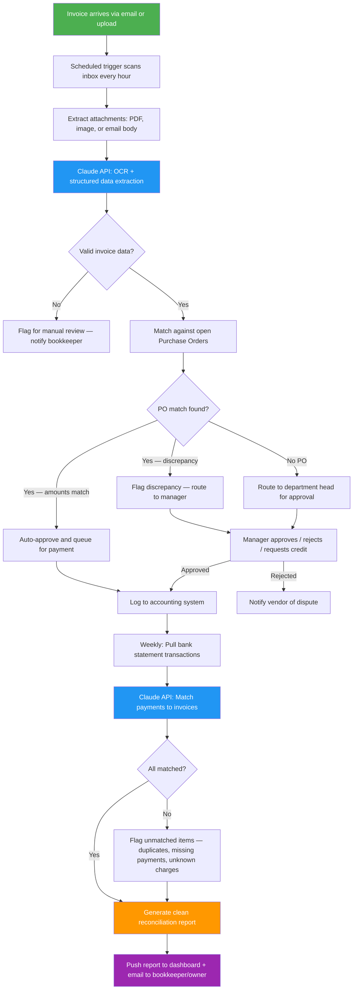

# Blueprint: Bookkeeper / AP Clerk — Automated Invoice Processing & Payment Reconciliation Report

**Role:** Bookkeeper, Accounts Payable Clerk, Small Business Finance Admin
**Pain Point:** 8–15 hours/week manually entering invoices, matching them to purchase orders, chasing approvals, and reconciling payments against bank statements
**Time Saved:** ~10–12 hours/week
**Difficulty to Implement:** Low–Medium
**Tools Required:** Email inbox (Gmail/Outlook), Claude API or any LLM API, Python or Zapier/Make, Google Sheets or QuickBooks/Xero API, bank statement CSV exports or Plaid integration, optional Slack/Teams for notifications

---

## The Problem

Every small to mid-sized business has someone — a bookkeeper, an office manager wearing a finance hat, or a dedicated AP clerk — who spends the bulk of their week on the same grueling loop: vendors send invoices by email (some as PDFs, some as images, some buried in the email body), that person opens each one, squints at the line items, manually keys the data into accounting software, checks whether there's a matching purchase order, flags discrepancies, routes the invoice to a manager for approval, follows up when that manager forgets, and then at the end of the month sits down with bank statements to make sure every payment lines up with an invoice and every invoice lines up with a payment.

For a company processing 80–200 invoices per month, this cycle consumes 8–15 hours per week. The work is mind-numbing, error-prone, and carries real financial risk: a miskeyed amount means you overpay a vendor, a missed invoice means you get hit with late fees, a duplicate payment means cash walking out the door. Industry data shows that manual invoice processing costs $12–$15 per invoice when you factor in labor, error correction, and late-payment penalties. Automation drops that to $2–$4.

This blueprint builds an end-to-end pipeline that ingests invoices from email, extracts and validates data with AI, matches invoices to POs, routes approvals automatically, and produces a weekly reconciliation report that compares your books against your bank — catching mismatches, duplicates, and missing payments before they become problems.

---

## Workflow Overview



---

## Why This Should Be Implemented

### The Business Case

| Metric | Before Automation | After Automation |
|--------|-------------------|------------------|
| Cost per invoice processed | $12–$15 | $2–$4 |
| Invoice processing time | 8–15 min each | < 1 min each |
| Data entry errors per month | 5–10% of invoices | < 1% |
| Duplicate payment rate | 1–2% of payments | Near zero |
| Month-end reconciliation time | 4–6 hours | 20–30 minutes (review only) |
| Late payment penalties per year | $2,000–$8,000 | Near zero |
| Approval turnaround | 2–5 business days | Same day |

### Who Benefits

- **Bookkeepers / AP Clerks** stop doing data entry and focus on cash flow management, vendor relationships, and financial strategy
- **Business Owners** get real-time visibility into payables, outstanding invoices, and cash position
- **Department Managers** get streamlined approval workflows on their phone instead of chasing paper
- **Vendors** get paid faster, which often unlocks early-payment discounts (typically 1–2% net-10)
- **Accountants / CPAs** get clean, organized records at tax time instead of a shoebox of receipts

---

## Detailed Implementation

### Step 1: Ingest Invoices from Email

**Trigger:** Scheduled scan every hour (or email webhook)

Invoices arrive in every format imaginable. The system needs to handle PDFs, scanned images, Excel files, and plain-text emails.

```python
import imaplib
import email
import os
import json
from datetime import datetime, timedelta
from pathlib import Path

class InvoiceIngestion:
    """Scans email inbox for incoming vendor invoices."""

    INVOICE_KEYWORDS = [
        'invoice', 'inv #', 'inv#', 'bill', 'statement',
        'amount due', 'payment due', 'remittance', 'balance due'
    ]

    def __init__(self, email_config: dict, output_dir: str = './incoming_invoices'):
        self.config = email_config
        self.output_dir = Path(output_dir)
        self.output_dir.mkdir(parents=True, exist_ok=True)

    def scan_inbox(self, hours_back: int = 1) -> list[dict]:
        """Pull emails from the last N hours that look like invoices."""
        mail = imaplib.IMAP4_SSL(self.config['server'])
        mail.login(self.config['user'], self.config['password'])
        mail.select('inbox')

        since_date = (datetime.now() - timedelta(hours=hours_back)).strftime("%d-%b-%Y")
        _, message_ids = mail.search(None, f'(SINCE "{since_date}")')

        candidates = []
        for msg_id in message_ids[0].split():
            _, msg_data = mail.fetch(msg_id, '(RFC822)')
            msg = email.message_from_bytes(msg_data[0][1])

            subject = msg.get('subject', '')
            sender = msg.get('from', '')
            body = self._extract_body(msg)
            attachments = self._extract_attachments(msg)

            if self._looks_like_invoice(subject, body, attachments):
                candidates.append({
                    'message_id': msg_id.decode(),
                    'sender': sender,
                    'subject': subject,
                    'body': body,
                    'attachments': attachments,
                    'received_at': datetime.now().isoformat()
                })

        mail.logout()
        return candidates

    def _looks_like_invoice(self, subject: str, body: str, attachments: list) -> bool:
        """Heuristic check: does this email contain an invoice?"""
        text = f"{subject} {body}".lower()
        keyword_match = any(kw in text for kw in self.INVOICE_KEYWORDS)
        has_pdf = any(att['filename'].lower().endswith('.pdf') for att in attachments)
        return keyword_match or has_pdf

    def _extract_body(self, msg) -> str:
        """Get plain-text body from email message."""
        if msg.is_multipart():
            for part in msg.walk():
                if part.get_content_type() == 'text/plain':
                    return part.get_payload(decode=True).decode('utf-8', errors='replace')
        return msg.get_payload(decode=True).decode('utf-8', errors='replace')

    def _extract_attachments(self, msg) -> list[dict]:
        """Save attachments and return metadata."""
        attachments = []
        if msg.is_multipart():
            for part in msg.walk():
                filename = part.get_filename()
                if filename:
                    filepath = self.output_dir / f"{datetime.now().strftime('%Y%m%d_%H%M%S')}_{filename}"
                    with open(filepath, 'wb') as f:
                        f.write(part.get_payload(decode=True))
                    attachments.append({
                        'filename': filename,
                        'filepath': str(filepath),
                        'content_type': part.get_content_type(),
                        'size_bytes': os.path.getsize(filepath)
                    })
        return attachments
```

---

### Step 2: Extract Structured Data with AI

This is where the magic happens. Instead of a human squinting at a PDF and typing numbers into QuickBooks, we send the invoice content to Claude and get back clean, structured data.

```python
import anthropic
import base64
import json

class InvoiceExtractor:
    """Uses Claude to extract structured invoice data from any format."""

    EXTRACTION_PROMPT = """You are an expert accounts payable clerk. Extract all invoice
    data from the provided document and return it as structured JSON.

    Required fields:
    - vendor_name: Company or person who sent the invoice
    - vendor_address: Full mailing address
    - invoice_number: The invoice/bill number
    - invoice_date: Date the invoice was issued (YYYY-MM-DD)
    - due_date: Payment due date (YYYY-MM-DD)
    - po_number: Purchase order number if referenced (null if not present)
    - currency: Three-letter currency code (default USD)
    - line_items: Array of items, each with:
        - description: What was purchased
        - quantity: Number of units
        - unit_price: Price per unit
        - amount: Line total
        - gl_code: General ledger code if mentioned (null if not)
    - subtotal: Sum before tax
    - tax_amount: Tax charged (0 if none)
    - shipping_amount: Shipping charged (0 if none)
    - total_amount: Final amount due
    - payment_terms: e.g. "Net 30", "Due on receipt", "2/10 Net 30"
    - bank_details: Wire/ACH info if provided (null if not)
    - notes: Any special instructions or references

    If a field is ambiguous, provide your best interpretation and add a
    "confidence" key with value "low", "medium", or "high".
    If something is completely missing, use null.
    Return ONLY valid JSON — no markdown, no commentary."""

    def __init__(self, api_key: str):
        self.client = anthropic.Anthropic(api_key=api_key)

    def extract_from_pdf(self, pdf_path: str) -> dict:
        """Extract invoice data from a PDF file."""
        with open(pdf_path, 'rb') as f:
            pdf_bytes = f.read()
        pdf_b64 = base64.standard_b64encode(pdf_bytes).decode('utf-8')

        response = self.client.messages.create(
            model="claude-sonnet-4-6",
            max_tokens=4096,
            messages=[{
                "role": "user",
                "content": [
                    {
                        "type": "document",
                        "source": {
                            "type": "base64",
                            "media_type": "application/pdf",
                            "data": pdf_b64
                        }
                    },
                    {"type": "text", "text": self.EXTRACTION_PROMPT}
                ]
            }]
        )
        return json.loads(response.content[0].text)

    def extract_from_email_body(self, email_text: str) -> dict:
        """Extract invoice data from plain-text email body."""
        response = self.client.messages.create(
            model="claude-sonnet-4-6",
            max_tokens=4096,
            messages=[{
                "role": "user",
                "content": f"{self.EXTRACTION_PROMPT}\n\n---\nEMAIL CONTENT:\n{email_text}"
            }]
        )
        return json.loads(response.content[0].text)

    def validate_extraction(self, data: dict) -> dict:
        """Run basic sanity checks on extracted data."""
        issues = []

        # Check line items sum to subtotal
        if data.get('line_items') and data.get('subtotal'):
            calc_subtotal = sum(item.get('amount', 0) for item in data['line_items'])
            if abs(calc_subtotal - data['subtotal']) > 0.01:
                issues.append(f"Line items sum ({calc_subtotal}) != subtotal ({data['subtotal']})")

        # Check subtotal + tax + shipping = total
        if all(data.get(k) is not None for k in ['subtotal', 'tax_amount', 'total_amount']):
            calc_total = data['subtotal'] + data.get('tax_amount', 0) + data.get('shipping_amount', 0)
            if abs(calc_total - data['total_amount']) > 0.01:
                issues.append(f"Calculated total ({calc_total}) != stated total ({data['total_amount']})")

        # Check dates are reasonable
        if data.get('invoice_date') and data.get('due_date'):
            from datetime import datetime
            inv_date = datetime.strptime(data['invoice_date'], '%Y-%m-%d')
            due_date = datetime.strptime(data['due_date'], '%Y-%m-%d')
            if due_date < inv_date:
                issues.append("Due date is before invoice date")

        # Check for duplicate invoice number
        # (In production, query your database here)

        data['_validation_issues'] = issues
        data['_is_valid'] = len(issues) == 0
        return data
```

---

### Step 3: Three-Way Match — Invoice vs. PO vs. Receipt

The gold standard in accounts payable is the three-way match: does the invoice match what was ordered (PO) and what was received (goods receipt)? This step automates that comparison.

```python
class ThreeWayMatcher:
    """Matches invoices against purchase orders and receiving records."""

    TOLERANCE_PERCENT = 2.0  # Allow 2% variance for rounding, shipping estimates
    TOLERANCE_ABSOLUTE = 5.00  # Allow $5 absolute variance

    def __init__(self, po_database, receiving_log):
        self.po_db = po_database       # Dict or DB connection: {po_number: po_data}
        self.receiving = receiving_log  # Dict or DB connection: {po_number: receipt_data}

    def match(self, invoice: dict) -> dict:
        """Perform three-way match and return result with status."""
        po_number = invoice.get('po_number')

        # --- No PO referenced ---
        if not po_number:
            return {
                'status': 'NO_PO',
                'action': 'ROUTE_FOR_APPROVAL',
                'message': 'No purchase order referenced. Requires department head approval.',
                'invoice': invoice,
                'po': None,
                'receipt': None
            }

        # --- Look up PO ---
        po = self.po_db.get(po_number)
        if not po:
            return {
                'status': 'PO_NOT_FOUND',
                'action': 'FLAG_FOR_REVIEW',
                'message': f'PO {po_number} not found in system. Possible typo or external PO.',
                'invoice': invoice,
                'po': None,
                'receipt': None
            }

        # --- Look up receiving record ---
        receipt = self.receiving.get(po_number)

        # --- Compare amounts ---
        inv_total = invoice.get('total_amount', 0)
        po_total = po.get('total_amount', 0)
        variance = abs(inv_total - po_total)
        variance_pct = (variance / po_total * 100) if po_total > 0 else 100

        within_tolerance = (
            variance <= self.TOLERANCE_ABSOLUTE or
            variance_pct <= self.TOLERANCE_PERCENT
        )

        # --- Compare line items ---
        line_item_issues = self._compare_line_items(
            invoice.get('line_items', []),
            po.get('line_items', [])
        )

        # --- Determine status ---
        if within_tolerance and not line_item_issues and receipt:
            return {
                'status': 'FULL_MATCH',
                'action': 'AUTO_APPROVE',
                'message': 'Invoice matches PO and goods received. Safe to pay.',
                'invoice': invoice,
                'po': po,
                'receipt': receipt,
                'variance': variance,
                'variance_pct': round(variance_pct, 2)
            }
        elif within_tolerance and not receipt:
            return {
                'status': 'PENDING_RECEIPT',
                'action': 'HOLD',
                'message': 'Invoice matches PO but goods not yet marked as received.',
                'invoice': invoice,
                'po': po,
                'receipt': None,
                'variance': variance
            }
        else:
            return {
                'status': 'DISCREPANCY',
                'action': 'ROUTE_TO_MANAGER',
                'message': f'Variance of ${variance:.2f} ({variance_pct:.1f}%) exceeds tolerance.',
                'invoice': invoice,
                'po': po,
                'receipt': receipt,
                'variance': variance,
                'variance_pct': round(variance_pct, 2),
                'line_item_issues': line_item_issues
            }

    def _compare_line_items(self, inv_items: list, po_items: list) -> list:
        """Compare invoice line items against PO line items."""
        issues = []
        for inv_item in inv_items:
            desc = inv_item.get('description', '').lower()
            matched_po_item = None
            for po_item in po_items:
                if self._descriptions_match(desc, po_item.get('description', '').lower()):
                    matched_po_item = po_item
                    break

            if not matched_po_item:
                issues.append(f"Invoice item '{inv_item['description']}' has no matching PO line")
            else:
                if inv_item.get('quantity', 0) > matched_po_item.get('quantity', 0):
                    issues.append(
                        f"'{inv_item['description']}': invoiced qty "
                        f"({inv_item['quantity']}) > PO qty ({matched_po_item['quantity']})"
                    )
                if inv_item.get('unit_price', 0) != matched_po_item.get('unit_price', 0):
                    issues.append(
                        f"'{inv_item['description']}': unit price mismatch — "
                        f"invoice ${inv_item['unit_price']} vs PO ${matched_po_item['unit_price']}"
                    )
        return issues

    def _descriptions_match(self, desc1: str, desc2: str) -> bool:
        """Fuzzy match on item descriptions."""
        # Simple overlap check; in production use fuzzy matching library
        words1 = set(desc1.split())
        words2 = set(desc2.split())
        overlap = len(words1 & words2) / max(len(words1 | words2), 1)
        return overlap > 0.5
```

---

### Step 4: Automated Approval Routing

Instead of the bookkeeper walking an invoice to a manager's desk or sending an email that gets buried, the system routes approvals automatically based on amount thresholds and department.

```python
import smtplib
from email.mime.text import MIMEText
from email.mime.multipart import MIMEMultipart

class ApprovalRouter:
    """Routes invoices for approval based on amount thresholds and department."""

    def __init__(self, approval_matrix: dict, notification_config: dict):
        """
        approval_matrix example:
        {
            'default': [
                {'max_amount': 500, 'approver': 'bookkeeper@company.com', 'auto': True},
                {'max_amount': 5000, 'approver': 'manager@company.com', 'auto': False},
                {'max_amount': float('inf'), 'approver': 'cfo@company.com', 'auto': False}
            ],
            'IT': [
                {'max_amount': 2000, 'approver': 'it-lead@company.com', 'auto': False},
                {'max_amount': float('inf'), 'approver': 'cto@company.com', 'auto': False}
            ]
        }
        """
        self.matrix = approval_matrix
        self.notif_config = notification_config

    def route(self, invoice: dict, match_result: dict) -> dict:
        """Determine who needs to approve this invoice and notify them."""

        if match_result['action'] == 'AUTO_APPROVE':
            return {
                'approved': True,
                'approver': 'SYSTEM (three-way match)',
                'method': 'automatic',
                'timestamp': datetime.now().isoformat()
            }

        # Determine department and amount
        department = invoice.get('department', 'default')
        amount = invoice.get('total_amount', 0)
        rules = self.matrix.get(department, self.matrix['default'])

        # Find the right approver
        for rule in rules:
            if amount <= rule['max_amount']:
                if rule['auto']:
                    return {
                        'approved': True,
                        'approver': rule['approver'],
                        'method': 'auto (under threshold)',
                        'timestamp': datetime.now().isoformat()
                    }
                else:
                    self._send_approval_request(invoice, match_result, rule['approver'])
                    return {
                        'approved': False,
                        'pending_approver': rule['approver'],
                        'method': 'manual review requested',
                        'requested_at': datetime.now().isoformat()
                    }

    def _send_approval_request(self, invoice: dict, match_result: dict, approver_email: str):
        """Send approval request email with invoice summary."""
        subject = (
            f"[Approval Needed] Invoice #{invoice['invoice_number']} "
            f"from {invoice['vendor_name']} — ${invoice['total_amount']:,.2f}"
        )
        body = f"""
        Invoice requires your approval:

        Vendor:          {invoice['vendor_name']}
        Invoice #:       {invoice['invoice_number']}
        Amount:          ${invoice['total_amount']:,.2f}
        Due Date:        {invoice['due_date']}
        PO Reference:    {invoice.get('po_number', 'None')}
        Match Status:    {match_result['status']}
        Notes:           {match_result['message']}

        Reply APPROVE or REJECT (with reason) to process this invoice.
        """
        # In production: send via SMTP, Slack, or approval platform
        print(f"[APPROVAL REQUEST] Sent to {approver_email}: {subject}")
```

---

### Step 5: Bank Statement Reconciliation

At month-end (or weekly for tighter control), the system pulls bank transactions and matches them against processed invoices to catch discrepancies.

```python
import csv
from datetime import datetime

class BankReconciler:
    """Matches bank statement transactions against processed invoices."""

    MATCH_TOLERANCE = 0.50  # Allow 50 cents for rounding differences

    def __init__(self, processed_invoices: list[dict]):
        self.invoices = {
            inv['invoice_number']: inv for inv in processed_invoices
        }
        self.matched = []
        self.unmatched_bank = []
        self.unmatched_invoices = []
        self.duplicates = []

    def load_bank_statement(self, csv_path: str) -> list[dict]:
        """Parse bank statement CSV (supports common formats)."""
        transactions = []
        with open(csv_path, 'r') as f:
            reader = csv.DictReader(f)
            for row in reader:
                # Normalize common column name variations
                txn = {
                    'date': row.get('Date') or row.get('Transaction Date') or row.get('Posted Date'),
                    'description': row.get('Description') or row.get('Memo') or row.get('Payee'),
                    'amount': abs(float(
                        (row.get('Amount') or row.get('Debit') or row.get('Withdrawal') or '0')
                        .replace(',', '').replace('$', '')
                    )),
                    'type': 'debit' if float(
                        (row.get('Amount') or row.get('Debit') or '0')
                        .replace(',', '').replace('$', '').replace('-', '')
                    ) else 'credit',
                    'reference': row.get('Reference') or row.get('Check #') or '',
                    'raw': row
                }
                transactions.append(txn)
        return transactions

    def reconcile(self, transactions: list[dict]) -> dict:
        """Match bank transactions to invoices and identify discrepancies."""

        invoice_pool = dict(self.invoices)  # Copy to track unmatched
        seen_amounts = {}  # Track potential duplicates

        for txn in transactions:
            if txn['type'] != 'debit':
                continue  # Only match outgoing payments

            match = self._find_matching_invoice(txn, invoice_pool)

            if match:
                self.matched.append({
                    'transaction': txn,
                    'invoice': match,
                    'variance': abs(txn['amount'] - match['total_amount'])
                })
                # Remove from pool so it can't be double-matched
                invoice_pool.pop(match['invoice_number'], None)

                # Check for duplicate payments
                key = (match['vendor_name'], txn['amount'])
                if key in seen_amounts:
                    self.duplicates.append({
                        'warning': 'Possible duplicate payment',
                        'vendor': match['vendor_name'],
                        'amount': txn['amount'],
                        'first_date': seen_amounts[key],
                        'second_date': txn['date']
                    })
                seen_amounts[key] = txn['date']
            else:
                self.unmatched_bank.append(txn)

        # Any invoices left in the pool are unpaid
        self.unmatched_invoices = list(invoice_pool.values())

        return self._generate_report()

    def _find_matching_invoice(self, txn: dict, invoice_pool: dict) -> dict | None:
        """Try to match a bank transaction to an invoice."""
        # Strategy 1: Match by reference/invoice number in description
        for inv_num, inv in invoice_pool.items():
            if inv_num in txn.get('description', '') or inv_num in txn.get('reference', ''):
                return inv

        # Strategy 2: Match by exact amount + vendor name similarity
        for inv_num, inv in invoice_pool.items():
            if abs(txn['amount'] - inv['total_amount']) <= self.MATCH_TOLERANCE:
                vendor = inv.get('vendor_name', '').lower()
                desc = txn.get('description', '').lower()
                if any(word in desc for word in vendor.split() if len(word) > 3):
                    return inv

        # Strategy 3: Match by amount alone (with caution flag)
        for inv_num, inv in invoice_pool.items():
            if abs(txn['amount'] - inv['total_amount']) <= self.MATCH_TOLERANCE:
                inv['_match_confidence'] = 'low — matched by amount only'
                return inv

        return None

    def _generate_report(self) -> dict:
        """Compile the reconciliation report."""
        total_paid = sum(m['transaction']['amount'] for m in self.matched)
        total_outstanding = sum(inv['total_amount'] for inv in self.unmatched_invoices)
        total_unrecognized = sum(txn['amount'] for txn in self.unmatched_bank)

        return {
            'summary': {
                'report_date': datetime.now().isoformat(),
                'total_invoices_processed': len(self.invoices),
                'matched_payments': len(self.matched),
                'total_paid': round(total_paid, 2),
                'unmatched_bank_transactions': len(self.unmatched_bank),
                'total_unrecognized_charges': round(total_unrecognized, 2),
                'outstanding_invoices': len(self.unmatched_invoices),
                'total_outstanding': round(total_outstanding, 2),
                'potential_duplicates': len(self.duplicates),
                'reconciliation_status': 'CLEAN' if (
                    not self.unmatched_bank and
                    not self.unmatched_invoices and
                    not self.duplicates
                ) else 'REQUIRES_REVIEW'
            },
            'matched': self.matched,
            'unmatched_bank_transactions': self.unmatched_bank,
            'outstanding_invoices': self.unmatched_invoices,
            'potential_duplicates': self.duplicates
        }
```

---

### Step 6: Orchestrator — Tie It All Together

```python
import schedule
import time

class APAutomationPipeline:
    """Main orchestrator that runs the full invoice-to-reconciliation pipeline."""

    def __init__(self, config: dict):
        self.ingestion = InvoiceIngestion(config['email'])
        self.extractor = InvoiceExtractor(config['claude_api_key'])
        self.matcher = ThreeWayMatcher(config['po_database'], config['receiving_log'])
        self.router = ApprovalRouter(config['approval_matrix'], config['notifications'])
        self.processed_invoices = []

    def process_new_invoices(self):
        """Hourly job: ingest, extract, match, and route new invoices."""
        print(f"\n[{datetime.now()}] Scanning for new invoices...")

        candidates = self.ingestion.scan_inbox(hours_back=1)
        print(f"  Found {len(candidates)} potential invoices")

        for candidate in candidates:
            # Extract structured data
            if candidate['attachments']:
                pdf_attachments = [a for a in candidate['attachments']
                                   if a['filename'].lower().endswith('.pdf')]
                if pdf_attachments:
                    invoice_data = self.extractor.extract_from_pdf(
                        pdf_attachments[0]['filepath']
                    )
                else:
                    invoice_data = self.extractor.extract_from_email_body(
                        candidate['body']
                    )
            else:
                invoice_data = self.extractor.extract_from_email_body(
                    candidate['body']
                )

            # Validate
            invoice_data = self.extractor.validate_extraction(invoice_data)
            if not invoice_data['_is_valid']:
                print(f"  [WARN] Invoice from {candidate['sender']} has validation issues:")
                for issue in invoice_data['_validation_issues']:
                    print(f"         - {issue}")

            # Three-way match
            match_result = self.matcher.match(invoice_data)
            print(f"  Invoice #{invoice_data.get('invoice_number')}: {match_result['status']}")

            # Route for approval
            approval = self.router.route(invoice_data, match_result)

            # Store processed invoice
            invoice_data['_match_result'] = match_result
            invoice_data['_approval'] = approval
            self.processed_invoices.append(invoice_data)

    def weekly_reconciliation(self, bank_csv_path: str):
        """Weekly job: reconcile all processed invoices against bank statement."""
        print(f"\n[{datetime.now()}] Running weekly bank reconciliation...")

        reconciler = BankReconciler(self.processed_invoices)
        transactions = reconciler.load_bank_statement(bank_csv_path)
        report = reconciler.reconcile(transactions)

        # Print summary
        s = report['summary']
        print(f"""
        ╔══════════════════════════════════════════════════════╗
        ║     WEEKLY PAYMENT RECONCILIATION REPORT            ║
        ╠══════════════════════════════════════════════════════╣
        ║  Invoices Processed:    {s['total_invoices_processed']:>6}                      ║
        ║  Payments Matched:      {s['matched_payments']:>6}                      ║
        ║  Total Paid:            ${s['total_paid']:>12,.2f}              ║
        ║  ─────────────────────────────────────────────────── ║
        ║  Unrecognized Charges:  {s['unmatched_bank_transactions']:>6}  (${s['total_unrecognized_charges']:>10,.2f})  ║
        ║  Outstanding Invoices:  {s['outstanding_invoices']:>6}  (${s['total_outstanding']:>10,.2f})  ║
        ║  Potential Duplicates:  {s['potential_duplicates']:>6}                      ║
        ║  ─────────────────────────────────────────────────── ║
        ║  Status: {'CLEAN ✓' if s['reconciliation_status'] == 'CLEAN' else 'REVIEW NEEDED ⚠':>20}                  ║
        ╚══════════════════════════════════════════════════════╝
        """)

        return report

    def run(self):
        """Start the scheduled pipeline."""
        # Process invoices every hour
        schedule.every(1).hours.do(self.process_new_invoices)

        # Reconciliation every Friday at 4pm
        schedule.every().friday.at("16:00").do(
            self.weekly_reconciliation,
            bank_csv_path='./bank_statements/latest.csv'
        )

        print("AP Automation Pipeline started. Press Ctrl+C to stop.")
        while True:
            schedule.run_pending()
            time.sleep(60)


# --- CONFIGURATION & LAUNCH ---
if __name__ == '__main__':
    config = {
        'email': {
            'server': 'imap.gmail.com',
            'user': 'ap@yourcompany.com',
            'password': 'your-app-password'  # Use env vars in production
        },
        'claude_api_key': 'sk-ant-...',  # Use env vars in production
        'po_database': {},      # Connect to your ERP/accounting system
        'receiving_log': {},    # Connect to your inventory/receiving system
        'approval_matrix': {
            'default': [
                {'max_amount': 500, 'approver': 'bookkeeper@company.com', 'auto': True},
                {'max_amount': 5000, 'approver': 'ops-manager@company.com', 'auto': False},
                {'max_amount': float('inf'), 'approver': 'cfo@company.com', 'auto': False}
            ]
        },
        'notifications': {
            'smtp_server': 'smtp.gmail.com',
            'smtp_port': 587,
            'from_email': 'ap-bot@yourcompany.com'
        }
    }

    pipeline = APAutomationPipeline(config)
    pipeline.run()
```

---

## Example Prompt Templates

### Invoice Extraction Prompt (for Claude API)

```
You are an expert accounts payable clerk. I'm going to show you an invoice document.
Extract every piece of financial data and return it as structured JSON.

Be precise with numbers — a $1 error matters. If a field is unclear, flag it with
"confidence": "low". If tax is not explicitly listed, check if the total minus subtotal
implies a tax amount.

Watch for these common traps:
- Shipping listed as a line item vs. a separate charge
- Tax applied to some items but not others
- Early payment discounts (e.g., "2/10 Net 30" means 2% off if paid in 10 days)
- Credits or adjustments from prior invoices rolled into this one

Return ONLY valid JSON.
```

### Discrepancy Investigation Prompt

```
I have an invoice that doesn't match its purchase order. Help me understand the
discrepancy and suggest next steps.

Invoice total: $4,287.50 (Invoice #INV-2024-0892 from Acme Supplies)
PO total: $3,950.00 (PO #PO-2024-0341)
Variance: $337.50 (8.5%)

Line item differences:
- "Ergonomic desk chairs": Invoice says $425/unit, PO says $395/unit
- "Monitor arms": Invoice includes 5 units, PO only has 3

Is this likely a price increase, a quantity change, or a billing error?
What should I ask the vendor? Draft a professional email requesting clarification.
```

---

## Example Output: Weekly Reconciliation Dashboard

Here is what the automated weekly report looks like when delivered to the bookkeeper:

```
╔══════════════════════════════════════════════════════════════╗
║         WEEKLY AP RECONCILIATION REPORT                     ║
║         Week of April 13 – April 19, 2026                   ║
╠══════════════════════════════════════════════════════════════╣
║                                                              ║
║  INVOICE PROCESSING                                          ║
║  ────────────────                                            ║
║  New invoices received:        47                            ║
║  Auto-approved (3-way match):  31  (66%)                     ║
║  Routed for manager approval:  12  (26%)                     ║
║  Flagged for review:            4  ( 8%)                     ║
║  Total value processed:        $127,483.20                   ║
║                                                              ║
║  PAYMENT RECONCILIATION                                      ║
║  ─────────────────────                                       ║
║  Bank transactions scanned:    89                            ║
║  Matched to invoices:          82  (92%)                     ║
║  Unrecognized charges:          5  ($2,341.00)               ║
║  Outstanding (unpaid):          2  ($8,750.00)               ║
║                                                              ║
║  ⚠ ITEMS REQUIRING ATTENTION                                ║
║  ─────────────────────────                                   ║
║  1. POSSIBLE DUPLICATE: TechVendor LLC — $1,250.00           ║
║     Paid Apr 14 AND Apr 17 (same amount, same vendor)        ║
║     → Verify if second payment was intentional               ║
║                                                              ║
║  2. UNMATCHED CHARGE: $892.00 — "AMZN MKTP US"              ║
║     No matching invoice found                                ║
║     → Identify purchaser and obtain receipt                  ║
║                                                              ║
║  3. OVERDUE: Invoice #INV-9281 from CleanCo Services         ║
║     $4,500.00 — Due Apr 12 (7 days past due)                ║
║     → Process payment to avoid late fee                      ║
║                                                              ║
║  4. PRICE DISCREPANCY: Summit Office Supplies                ║
║     Invoice $2,847.50 vs PO $2,650.00 (+$197.50 / 7.5%)     ║
║     → Awaiting manager review since Apr 16                   ║
║                                                              ║
║  STATUS: REVIEW NEEDED (4 open items)                        ║
╚══════════════════════════════════════════════════════════════╝
```

---

## No-Code / Low-Code Alternative

Not every small business has a developer on hand. Here's how to build 80% of this workflow with no-code tools:

**Option A: Zapier + Google Sheets + Claude**

1. **Zap 1 — Invoice Ingestion:** Gmail trigger (new email with attachment matching "invoice" keyword) → Save attachment to Google Drive → Extract text with Google Drive OCR
2. **Zap 2 — Data Extraction:** Google Drive trigger (new file) → Send content to Claude API via Webhook → Parse JSON response → Add row to "Invoices" Google Sheet
3. **Zap 3 — Approval Routing:** Google Sheets trigger (new row) → IF amount > $500, send Slack message to approver → Approver reacts with thumbs-up → Update sheet status
4. **Zap 4 — Reconciliation:** Scheduled weekly → Pull bank CSV from email → Send to Claude API with invoice sheet data → Output reconciliation summary to email

**Option B: Make.com (Integromat)**

Same flow, but Make.com offers better branching logic and handles PDFs natively. Build a single scenario with router modules for different invoice types and approval paths.

**Estimated setup time:** 4–6 hours for initial configuration, then hands-off.

---

## Cost Estimate

| Component | Monthly Cost (for ~150 invoices/month) |
|-----------|---------------------------------------|
| Claude API (Sonnet, extraction + reconciliation) | $15–$30 |
| Zapier (multi-step zaps) or Make.com | $20–$50 |
| Google Workspace (Sheets, Drive) | Already included |
| QuickBooks/Xero API (if used) | Included with subscription |
| **Total** | **$35–$80/month** |

Compare this to 10–12 hours/week of bookkeeper time at $25–$40/hour, and the automation pays for itself within the first week of each month.

---

## Getting Started Checklist

1. **Set up a dedicated AP email address** (e.g., invoices@yourcompany.com) and have vendors send all invoices there
2. **Create your PO tracking sheet** — even a simple Google Sheet with PO number, vendor, amount, and date works to start
3. **Configure Claude API access** — sign up at console.anthropic.com, create an API key
4. **Build the ingestion pipeline** — start with the email scanner; test on 10 real invoices
5. **Define your approval matrix** — who approves what amounts for which departments
6. **Run parallel for 2 weeks** — process invoices both manually and automatically, compare results
7. **Switch to automated with human review** — bookkeeper reviews the dashboard instead of doing data entry
8. **Add bank reconciliation** — start with manual CSV upload, then automate with Plaid or bank API

---

## Risk Mitigation

**What if the AI misreads an invoice?** The validation layer catches mathematical inconsistencies. For the first month, flag every invoice for human review and track accuracy. Most teams see 97%+ accuracy after fine-tuning the extraction prompt for their specific vendor formats.

**What if we overpay someone?** The duplicate detection and three-way matching specifically guard against this. The system is more reliable than a tired human at 4pm on a Friday.

**What about sensitive financial data?** Claude's API doesn't train on your data. For extra security, strip vendor bank details before sending to the API and add them back from your internal vendor master file.

**What if our invoices are handwritten or very old-format?** Claude handles OCR on scanned documents well. For truly illegible documents, the system flags them for manual entry rather than guessing.

---

*Blueprint created: April 20, 2026*
*Estimated implementation time: 2–3 days (code path) or 4–6 hours (no-code path)*
*ROI breakeven: First week of operation*
