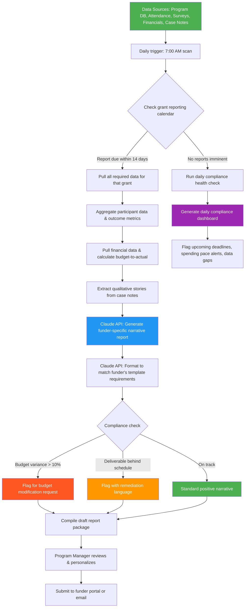

# Blueprint: Nonprofit Program Manager — Automated Grant Compliance & Impact Reporting

**Role:** Nonprofit Program Manager / Grants Manager
**Pain Point:** 12–18 hours per week spent manually tracking grant deliverables, compiling impact metrics across programs, cross-referencing expenditure reports against budgets, and writing funder-specific narrative reports with different formats and deadlines
**Time Saved:** ~10–14 hours/week
**Difficulty to Implement:** Low–Medium
**Tools Required:** Google Sheets or Airtable (program data), QuickBooks or accounting export (financials), Claude API or any LLM API, Zapier/Make or a Python script, Google Docs for report generation, email or funder portal for delivery

---

## The Problem

Nonprofit program managers live in a constant state of reporting anxiety. Most organizations juggle 5–15 active grants simultaneously, each with its own reporting cadence (monthly, quarterly, annually), its own required format (narrative templates, logic model updates, budget-to-actual spreadsheets), and its own definition of "impact" (some funders want participant counts, others want outcome percentages, others want qualitative stories).

The typical workflow looks like this: the program manager opens a spreadsheet to check which reports are due this month, then spends hours hunting down data scattered across program databases, attendance trackers, survey results stored in Google Forms, financial reports from the accounting team, and anecdotal success stories buried in case manager notes. They then manually calculate metrics — "How many participants completed the job training program this quarter? What percentage found employment within 90 days? How does spending compare to the approved budget line items?" — and write a narrative that frames the numbers in the context each funder cares about.

For an organization managing 10 grants, this means the program manager is essentially writing 10 different versions of the same story every reporting cycle, each tweaked to match a different template, a different set of KPIs, and a different funder's communication style. The data exists — it's just fragmented across systems and requires hours of manual assembly.

Missed deadlines or inconsistent reporting can trigger compliance flags, delayed reimbursements, or even loss of future funding. The stakes are high, the work is tedious, and the skills needed (data aggregation, financial reconciliation, persuasive writing) are exactly the kind of tasks AI handles well.

This blueprint automates the entire grant compliance and impact reporting pipeline — from deadline tracking and data aggregation to budget reconciliation and narrative generation — so program managers receive draft-ready reports days before they're due, with time to review and personalize before submission.

---

## Workflow Overview



---

## How It Works

### Step 1: Grant Calendar & Deadline Tracking (Automated Daily)

Every morning at 7:00 AM, the workflow scans a master grant calendar to determine what's coming due and what needs attention.

**Master Grant Calendar structure:**

| Grant Name | Funder | Award Amount | Period | Report Type | Frequency | Next Due Date | Template Link | Status |
|-----------|--------|-------------|--------|------------|-----------|--------------|---------------|--------|
| Youth Employment Initiative | City Foundation | $250,000 | 7/1/25–6/30/26 | Narrative + Financial | Quarterly | 6/30/2026 | [Template] | Active |
| STEM After-School Program | Federal DOE | $180,000 | 10/1/25–9/30/26 | Progress Report (ED 524B) | Semi-annual | 3/31/2026 | [Template] | Active |
| Food Security Network | United Way | $75,000 | 1/1/26–12/31/26 | Impact Dashboard | Monthly | 5/31/2026 | [Template] | Active |
| Mental Health Access | State DHHS | $320,000 | 4/1/25–3/31/27 | Performance Measures | Quarterly | 6/30/2026 | [Template] | Active |
| Digital Literacy Bridge | Tech Corp CSR | $50,000 | 3/1/26–2/28/27 | Story-based Update | Quarterly | 5/31/2026 | [Template] | Active |

**Trigger logic:**
- **14 days before due date** — Begin full data aggregation and draft generation
- **7 days before** — Send reminder if draft hasn't been reviewed
- **3 days before** — Escalation alert to program director
- **Daily** — Compliance health dashboard regardless of upcoming deadlines

### Step 2: Data Aggregation (Automated)

When a report is triggered, the workflow pulls data from all relevant sources and normalizes it into a unified grant record.

**Data sources and extraction:**

| Source | Data Pulled | Method |
|--------|------------|--------|
| Program Database (Airtable/Sheets) | Participant enrollment, demographics, completion status, outcomes | API or CSV export |
| Attendance Tracker | Session dates, participant attendance rates, dosage hours | API or CSV |
| Survey Results (Google Forms/SurveyMonkey) | Pre/post assessments, satisfaction scores, qualitative feedback | API |
| Accounting System (QuickBooks/Xero) | Expenditures by budget line item, encumbrances, remaining balance | CSV or API |
| Case Manager Notes (Sheets/Salesforce) | Individual success stories, challenges, qualitative observations | Keyword search + extraction |
| Partner Reports | Sub-grantee deliverables, collaborative metrics | Email parsing or shared sheet |

**Example aggregated data for one grant:**

```json
{
  "grant_name": "Youth Employment Initiative",
  "funder": "City Foundation",
  "reporting_period": "Q3 FY2026 (Jan 1 – Mar 31, 2026)",
  "program_metrics": {
    "total_enrolled": 142,
    "new_this_quarter": 38,
    "completed_program": 27,
    "still_active": 89,
    "dropped_out": 26,
    "retention_rate": "81.7%",
    "demographics": {
      "age_18_24": "67%",
      "age_25_34": "33%",
      "gender_female": "54%",
      "gender_male": "44%",
      "gender_nonbinary": "2%",
      "race_black": "41%",
      "race_hispanic": "32%",
      "race_white": "18%",
      "race_other": "9%"
    }
  },
  "outcome_metrics": {
    "completed_job_readiness_training": 27,
    "obtained_industry_certification": 19,
    "placed_in_employment": 14,
    "placed_in_internship": 8,
    "employment_rate_90_day": "72.4%",
    "average_starting_wage": "$17.85/hr",
    "enrolled_in_further_education": 5
  },
  "financial_summary": {
    "total_budget": 250000,
    "ytd_spent": 168420,
    "this_quarter_spent": 62150,
    "budget_lines": {
      "personnel": {"budgeted": 125000, "spent": 91230, "variance": "-27.0%"},
      "participant_support": {"budgeted": 45000, "spent": 34800, "variance": "-22.7%"},
      "supplies_materials": {"budgeted": 20000, "spent": 18390, "variance": "-8.1%"},
      "contracted_services": {"budgeted": 35000, "spent": 14000, "variance": "-60.0%"},
      "indirect_costs": {"budgeted": 25000, "spent": 10000, "variance": "-60.0%"}
    },
    "burn_rate_on_track": false,
    "projected_underspend": 42580,
    "flags": ["Contracted services significantly underspent — vendor delay on employer partnership coordinator"]
  },
  "qualitative_highlights": [
    {
      "participant": "J.R., age 22",
      "story": "Entered program after 18 months of unemployment following incarceration. Completed forklift certification and warehouse safety training. Placed at regional distribution center at $19.50/hr. Now mentoring newer participants in the program."
    },
    {
      "participant": "A.M., age 19",
      "story": "Single parent who completed evening cohort while maintaining childcare. Earned CompTIA A+ certification. Hired as junior IT support at a local healthcare system."
    }
  ]
}
```

### Step 3: Budget-to-Actual Reconciliation (Automated)

The workflow performs a line-by-line budget comparison and generates compliance flags:

**Budget Reconciliation Logic:**

```
FOR each budget_line in grant:
    variance = (budgeted - spent) / budgeted * 100
    
    IF variance > 10% (underspend):
        flag = "UNDERSPEND WARNING"
        action = "Generate explanation language + suggest budget modification if >25%"
    
    IF variance < -10% (overspend):
        flag = "OVERSPEND ALERT"  
        action = "Generate justification narrative + flag for prior approval check"
    
    IF spending_pace vs. time_elapsed differs by >15%:
        flag = "PACING CONCERN"
        action = "Project year-end position + recommend corrective action"
    
    ELSE:
        flag = "ON TRACK"
```

**Example output — Budget Health Summary:**

| Line Item | Budgeted | YTD Spent | % Used | % of Period Elapsed | Status | Note |
|-----------|----------|-----------|--------|-------------------|--------|------|
| Personnel | $125,000 | $91,230 | 73.0% | 75.0% | On Track | Spending aligns with timeline |
| Participant Support | $45,000 | $34,800 | 77.3% | 75.0% | On Track | Slight overpace — monitor |
| Supplies | $20,000 | $18,390 | 92.0% | 75.0% | Overpace | Bulk purchase in Q2 — explain in narrative |
| Contracted Services | $35,000 | $14,000 | 40.0% | 75.0% | Underspend | Vendor onboarding delayed — budget mod recommended |
| Indirect | $25,000 | $10,000 | 40.0% | 75.0% | Underspend | Tied to direct cost rate — will normalize |

### Step 4: AI-Powered Narrative Generation (Automated)

This is where the real time savings happen. The workflow sends the aggregated data to Claude with a funder-specific prompt that matches the required tone, format, and emphasis areas.

**Prompt template:**

```
You are a grant report writer for a nonprofit organization. Write a quarterly 
progress report narrative for the following grant. Match the funder's preferred 
style and format.

FUNDER PROFILE:
- Name: {funder_name}
- Style: {funder_style} // e.g., "Data-driven, wants specific numbers and percentages 
  in every paragraph" or "Story-first, wants participant journeys with data as supporting evidence"
- Required sections: {required_sections}
- Tone: {tone} // e.g., "Professional but warm" or "Formal and metrics-focused"
- Max length: {max_length}
- Special requirements: {special_requirements}

PROGRAM DATA:
{aggregated_json_data}

BUDGET HEALTH:
{budget_reconciliation_table}

QUALITATIVE DATA:
{participant_stories}

PREVIOUS REPORT SUMMARY (for continuity):
{previous_report_excerpt}

INSTRUCTIONS:
1. Write the narrative report following the funder's required sections
2. Incorporate specific numbers and percentages naturally
3. Include 1-2 participant success stories (anonymized per policy)
4. Address any budget variances proactively with explanation and corrective plan
5. Highlight achievements against stated grant objectives
6. Note any challenges honestly but frame them with solutions
7. End with a forward-looking paragraph about next quarter priorities
8. Flag any compliance concerns the program manager should review
```

**Example generated narrative (excerpt for City Foundation — story-first style):**

> **Program Highlights — Q3 FY2026**
>
> This quarter marked a significant milestone for the Youth Employment Initiative: our 100th participant placed in employment since the program's launch. Among those placed was J.R., a 22-year-old who entered the program after 18 months of unemployment. After completing our forklift certification and warehouse safety track, he was hired at a regional distribution center at $19.50 per hour and now volunteers as a peer mentor for newer cohorts.
>
> Across the quarter, 38 new participants enrolled, bringing total enrollment to 142 — exceeding our annual target of 120 by 18%. Of the 27 participants who completed the program this period, 14 secured employment and 8 began internships, yielding a 72.4% placement rate within our 90-day follow-up window. The average starting wage of $17.85/hour represents a 12% increase over our Year 1 average, reflecting our expanded employer partnership network.
>
> **Budget Note:** We want to flag that our Contracted Services line is currently at 40% utilization against 75% of the grant period elapsed. This is due to a delayed onboarding of our employer partnership coordinator — the original vendor experienced staffing challenges. We have since engaged a new contractor who began March 1 and we project full utilization by year-end. We welcome the opportunity to discuss whether a formal budget modification would be appropriate, or whether the current trajectory is acceptable given the Q4 catch-up plan.

### Step 5: Compliance Dashboard (Daily Automated Output)

Regardless of whether reports are due, the workflow generates a daily compliance health dashboard that gives the program manager an at-a-glance view of all grants.

**Example Daily Compliance Dashboard:**

```
╔══════════════════════════════════════════════════════════════════╗
║          GRANT COMPLIANCE DASHBOARD — May 12, 2026              ║
╠══════════════════════════════════════════════════════════════════╣
║                                                                  ║
║  UPCOMING DEADLINES                                              ║
║  ├── Food Security Network (United Way)                          ║
║  │   Monthly Impact Dashboard — Due May 31 (19 days)             ║
║  │   Status: DRAFT READY — Review by May 25                     ║
║  │                                                               ║
║  ├── Digital Literacy Bridge (Tech Corp)                         ║
║  │   Quarterly Story Update — Due May 31 (19 days)               ║
║  │   Status: DATA COLLECTED — Draft generating May 17            ║
║  │                                                               ║
║  └── Youth Employment Initiative (City Foundation)               ║
║      Quarterly Narrative + Financial — Due Jun 30 (49 days)      ║
║      Status: MONITORING — Auto-trigger Jun 16                    ║
║                                                                  ║
║  SPENDING ALERTS                                                 ║
║  ├── Mental Health Access: Personnel line 94% spent (50%         ║
║  │   of period) — OVERSPEND RISK — Review immediately            ║
║  ├── Youth Employment: Contracted Services 40% spent (75%        ║
║  │   of period) — UNDERSPEND — Budget mod recommended            ║
║  └── All other lines: ON TRACK                                   ║
║                                                                  ║
║  DATA GAPS                                                       ║
║  ├── STEM Program: Q2 survey results not yet uploaded            ║
║  │   (Blocking semi-annual report due Mar 31 — OVERDUE)          ║
║  └── Food Security: April attendance data incomplete              ║
║      (3 of 8 sites reporting — Follow up with site leads)        ║
║                                                                  ║
║  OVERALL HEALTH: 3 Active Grants On Track | 1 Needs Attention   ║
║                  1 Has Overdue Report (STEM — escalated)         ║
╚══════════════════════════════════════════════════════════════════╝
```

---

## Implementation Guide

### Week 1: Setup (Days 1–5)

**Day 1 — Audit your grant portfolio**
- List all active grants with deadlines, required formats, and funder contacts
- Create the master Grant Calendar spreadsheet (use the template above)
- Identify which funder wants which style of reporting

**Day 2 — Map your data sources**
- Document where each type of data lives (participant data, financials, stories)
- Ensure all sources are exportable (CSV, API, or accessible via automation tools)
- Identify data gaps and assign someone to close them

**Day 3 — Build the data pipeline**
- Set up automated exports or API connections from each data source
- Create a "Grant Data Hub" spreadsheet or Airtable base that receives normalized data
- Test with one grant's data to ensure completeness

**Day 4 — Configure the AI narrative engine**
- Set up Claude API access (or use Zapier's AI integration)
- Create funder-specific prompt templates for each active grant
- Test narrative generation with sample data — adjust tone and format

**Day 5 — Wire up the automation**
- Connect the daily trigger (Zapier/Make scheduled workflow)
- Set up the 14-day / 7-day / 3-day deadline alert chain
- Configure email delivery for the daily compliance dashboard
- Run a full end-to-end test with one grant

### Week 2: Refine & Expand

- Generate draft reports for all grants due in the next 30 days
- Compare AI-generated narratives against your last manually written reports
- Adjust prompts based on quality gaps
- Add all remaining grants to the automated pipeline
- Train any co-managers on how to review and submit AI-drafted reports

---

## Cost Estimate

| Component | Tool | Monthly Cost |
|-----------|------|-------------|
| Data Hub | Google Sheets (free) or Airtable Pro | $0–$20 |
| Automation Platform | Zapier Starter or Make Pro | $20–$30 |
| AI Narrative Generation | Claude API (Sonnet) | $15–$40 |
| Report Delivery | Gmail (free) or SendGrid | $0 |
| **Total** | | **$35–$90/month** |

---

## ROI Analysis

| Metric | Manual Process | Automated Process | Savings |
|--------|---------------|-------------------|---------|
| Time per quarterly report | 6–10 hours | 1–2 hours (review only) | 5–8 hours |
| Reports managed per month | 3–5 | 3–5 (no limit) | Same volume, fraction of time |
| Missed deadline risk | High (calendar-dependent) | Near zero (automated alerts) | Reputation protection |
| Budget variance detection | Found at report time | Found daily | Weeks of early warning |
| Data gap identification | Found at report time | Found daily | Proactive resolution |
| Compliance confidence | Moderate (manual checks) | High (automated reconciliation) | Reduced audit risk |

**For a program manager handling 10 grants:**
- Manual: ~15 hours/week on reporting tasks = $31,200/year (at $40/hr)
- Automated: ~3 hours/week on review and personalization = $6,240/year
- **Annual savings: ~$25,000 in staff time** (redirected to program delivery)
- **Automation cost: ~$720–$1,080/year**
- **Net ROI: 2,200–3,400%**

---

## Advanced Enhancements

### Phase 2: Funder Relationship Intelligence
- Track funder communication history and preferences
- Auto-generate thank-you updates between formal reporting periods
- Flag grant renewal windows 90 days in advance with performance summary

### Phase 3: Board Reporting Automation
- Aggregate all grant data into a monthly board report
- Auto-generate program dashboards for board meetings
- Track organizational-level outcomes across all grants

### Phase 4: Grant Prospecting Support
- Compare current program metrics against new grant opportunity requirements
- Auto-draft Letters of Intent using existing program data
- Score grant fit based on organizational capacity and funder alignment

---

## Prompt Library

### Prompt 1: Quarterly Narrative Report (Story-First Funder)

```
Write a quarterly progress report for {grant_name} funded by {funder_name}. 
This funder values participant stories and human impact over raw data. Lead 
with 1-2 compelling participant journeys, weave in quantitative outcomes 
naturally, and address any budget variances with transparency and a clear 
corrective plan. Tone should be warm, confident, and community-centered. 
Keep to {max_words} words.

Data: {json_data}
```

### Prompt 2: Federal Progress Report (Data-Heavy Format)

```
Write a federal grant progress report following the ED 524B format for 
{grant_name}. Use formal language. Every claim must be supported by a 
specific number or percentage. Organize by: (1) Major Activities, 
(2) Performance Measures with targets vs. actuals, (3) Significant Findings, 
(4) Dissemination Activities, (5) Budget Summary. Flag any performance 
measures below 80% of target with an explanation and remediation plan.

Data: {json_data}
```

### Prompt 3: Monthly Impact Dashboard (Visual/Metrics Funder)

```
Generate a concise monthly impact snapshot for {grant_name}. Format as 
a dashboard with: top-line KPIs (3-5 numbers with month-over-month trend 
arrows), a 3-sentence program highlight, one participant spotlight (2 sentences), 
and a budget health bar. This funder wants to see progress at a glance — 
think infographic, not essay. Keep total text under 200 words.

Data: {json_data}
```

### Prompt 4: Budget Variance Explanation

```
Write a professional budget variance explanation for {grant_name}. The 
following line items have variances exceeding 10%: {flagged_lines}. For each, 
provide: (1) what caused the variance, (2) whether it's a timing issue or 
a structural change, (3) projected year-end position, (4) corrective action 
if needed. Tone should be proactive and solution-oriented — never defensive. 
If a budget modification request is warranted, recommend it explicitly.

Data: {budget_data}
```

---

## Sample Compliance Alert Email

```
Subject: Grant Compliance Alert — Action Required (2 items)

Good morning,

Your daily grant compliance scan identified 2 items needing attention:

1. OVERSPEND RISK — Mental Health Access (State DHHS)
   Personnel line is at 94% spent with 50% of the grant period remaining.
   Recommended action: Review staffing charges for miscoded expenses 
   or submit a budget modification request by May 20.

2. DATA GAP — STEM After-School Program (Federal DOE)
   Q2 participant survey results have not been uploaded. This data is 
   required for the semi-annual report (currently 42 days overdue).
   Recommended action: Contact Program Coordinator Sarah Kim for status.

All other grants are currently on track. Full dashboard attached.

---
This is an automated compliance alert from your Grant Reporting Workflow.
```

---

## Why This Works

Nonprofit program managers are uniquely burdened by reporting requirements because every funder has different expectations, different templates, and different definitions of success. The data to satisfy all of them already exists — it's just trapped in disconnected spreadsheets, databases, and email threads. This workflow doesn't replace the program manager's judgment or relationship with funders. It replaces the 80% of reporting time spent on data assembly and first-draft writing, so the program manager can focus on the 20% that actually requires human insight: contextualizing results, strengthening funder relationships, and improving programs based on what the data reveals.

The daily compliance dashboard alone is worth the implementation effort — most nonprofit managers don't discover budget problems or data gaps until they sit down to write a report, by which point the deadline is looming and the options for correction are limited. Catching these issues 30–60 days early transforms grant management from reactive crisis mode to proactive strategic oversight.

---

*Blueprint created May 12, 2026 | Part of the Agentic Workflows collection*
*For nonprofit organizations managing 3+ concurrent grants*
