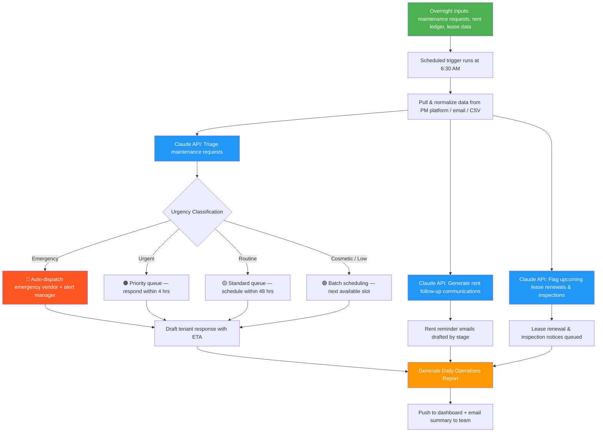

# Blueprint: Property Manager — Daily Maintenance Request Triage & Tenant Communication Report

**Role:** Property Manager / Community Manager / Residential Portfolio Manager
**Pain Point:** 3–5 hours daily reading maintenance requests, categorizing urgency, dispatching vendors, chasing overdue rent, and drafting tenant communications
**Time Saved:** ~15–20 hours/week
**Difficulty to Implement:** Low–Medium
**Tools Required:** Property management platform (AppFolio, Buildium, Rent Manager) or email inbox, Claude API (or any LLM API), Zapier/Make or a Python script, Google Sheets or internal dashboard

---

## The Problem

Property managers juggle an overwhelming volume of repetitive communication every single day. A typical manager overseeing 80–200 units starts their morning buried in maintenance requests that came in overnight — everything from "my toilet is running" to "there's water coming through the ceiling." Each request needs to be read, assessed for urgency, categorized by trade (plumbing, electrical, HVAC, general), matched to an available vendor, and responded to with an estimated timeline. Then there's the rent collection follow-up: identifying who hasn't paid, sending reminders at the right intervals, and escalating to formal notices when needed. Add in lease renewal outreach, move-in/move-out coordination, and inspection scheduling, and the administrative overhead is staggering.

Most small and mid-sized property management companies handle this with a patchwork of spreadsheets, email folders, and sticky notes. A maintenance request arrives via email, text, or portal. The manager reads it, mentally assesses urgency, calls or texts a vendor, then manually updates a tracking sheet. Rent follow-ups are done by pulling a delinquency report and individually crafting emails or letters. The result: emergency repairs get delayed because they're buried under cosmetic requests, rent reminders go out late because the manager ran out of time, and tenant satisfaction drops because response times are inconsistent.

This blueprint automates the entire daily operations triage so property managers start each day with a prioritized action board — maintenance dispatched, rent follow-ups queued, and tenant communications drafted and ready to send.

---

## Workflow Overview



---

## Step-by-Step Breakdown

### Step 1: Data Ingestion (Automated — runs at 6:30 AM)

A scheduled job pulls three data streams from the previous 24 hours:

**Stream A — Maintenance Requests:**
- From PM platform API (AppFolio, Buildium, Rent Manager) or monitored email inbox
- Extract: unit number, tenant name, request description, photos (if any), submission time

| Field | Example |
|-------|---------|
| Request ID | MR-2026-1847 |
| Property | Oakwood Apartments |
| Unit | 204-B |
| Tenant | James Ortega |
| Submitted | Apr 26, 2026 — 11:42 PM |
| Description | "Water is leaking from under the kitchen sink and the cabinet floor is getting wet. Started about 2 hours ago. I put a towel down but it's soaking through." |
| Photos | 2 attached (sink_leak_1.jpg, sink_leak_2.jpg) |
| Tenant Phone | (555) 918-3342 |

**Stream B — Rent Ledger:**
- Daily delinquency export: tenants with balances past due, days overdue, payment history
- Fields: tenant, unit, amount due, due date, days late, prior late count (12 months), last communication sent

**Stream C — Lease & Inspection Calendar:**
- Leases expiring within 60/90 days
- Upcoming scheduled inspections
- Move-in/move-out dates in the next 14 days

### Step 2: AI-Powered Maintenance Triage (Claude API)

Each batch of maintenance requests is sent to Claude with the following prompt:

```
You are a senior property manager with 20 years of experience managing
residential portfolios. Triage the following maintenance requests and
produce a structured assessment for each.

<maintenance_requests>
{REQUESTS_DATA}
</maintenance_requests>

For EACH request, provide:

1. URGENCY CLASSIFICATION:
   - 🔴 EMERGENCY: Active water leak/flood, no heat (below 50°F outside),
     gas smell, electrical hazard, lock/security breach, sewage backup,
     fire damage, broken window (ground floor), no hot water (48+ hrs)
   - 🟠 URGENT: Significant water leak (contained), HVAC failure (non-emergency
     temps), appliance failure (fridge/stove), partial power outage,
     pest infestation (roaches, bedbugs), clogged main drain
   - 🟡 ROUTINE: Running toilet, minor drip/leak, appliance issue (dishwasher,
     disposal), door/lock sticking, window not closing properly,
     drywall damage, light fixture replacement
   - 🟢 COSMETIC / LOW: Paint touch-up, caulking, weatherstripping,
     cabinet hardware, screen repair, non-urgent landscaping

2. TRADE CLASSIFICATION:
   - Plumbing, Electrical, HVAC, General Maintenance, Appliance Repair,
     Pest Control, Locksmith, Roofing, Landscaping

3. VENDOR MATCH:
   - Based on trade and urgency, suggest which vendor tier to dispatch:
     Emergency contractor (24/7), Preferred vendor, Handyman, or
     schedule for next maintenance day

4. HABITABILITY FLAG:
   - Does this affect habitability or safety? (Impacts legal response
     timeline requirements)
   - Note applicable response deadline per local landlord-tenant law

5. TENANT RESPONSE DRAFT:
   - Write a professional, empathetic response to the tenant that:
     a) Acknowledges their request
     b) Provides the expected timeline
     c) Gives any immediate instructions (e.g., "turn off the water
        supply valve under the sink")
     d) Includes vendor contact info if emergency dispatch

6. COST ESTIMATE RANGE:
   - Rough estimate based on description (Low: <$150, Medium: $150-500,
     High: $500-2000, Major: $2000+)

Format output as a structured report. Prioritize safety-critical and
habitability issues. Be concise but thorough.
```

### Step 3: AI-Powered Rent Follow-Up Generation (Claude API)

```
You are a property management communications specialist. Generate
appropriate rent collection communications for each delinquent tenant
based on their payment stage.

<delinquent_tenants>
{RENT_LEDGER_DATA}
</delinquent_tenants>

For EACH tenant, determine the appropriate communication stage and
draft the message:

STAGE 1 — Friendly Reminder (1-3 days late):
  - Warm, assumptive tone ("just a reminder")
  - Include payment portal link and amount due
  - Mention late fee policy without applying it yet

STAGE 2 — Formal Notice (4-7 days late):
  - Professional tone, state balance + late fee now applied
  - Offer to set up a payment plan if needed
  - Reference lease terms

STAGE 3 — Demand Letter (8-14 days late):
  - Firm, factual tone
  - State total balance with all fees
  - Reference cure period per state/local law
  - Mention next steps if payment isn't received

STAGE 4 — Pre-Eviction Notice (15+ days late):
  - Formal legal notice language
  - Flag for manager review before sending
  - DO NOT auto-send — requires human approval

Include tenant name, unit, amount, and personalize each message.
Flag any tenant with 3+ late payments in 12 months for a lease
non-renewal discussion.
```

### Step 4: Lease & Inspection Flagging

Claude reviews the lease calendar and flags:
- Leases expiring in 60 days → draft renewal offer with proposed terms
- Leases expiring in 90 days → early outreach to gauge tenant intent
- Inspections due this week → generate inspection checklist by unit type
- Move-outs in 14 days → trigger pre-move-out inspection scheduling and deposit accounting prep

### Step 5: Report Generation & Delivery

All outputs are compiled into a Daily Operations Report delivered at 7:00 AM:

- Operations dashboard updated (Google Sheet or PM platform)
- Summary emailed to property management team
- Emergency dispatches triggered immediately (not held for report)
- Rent communications queued for manager review/approval before sending

---

## Example Output

### 📋 Daily Property Operations Report — Sunday, April 27, 2026

**Portfolio: Oakwood Properties (3 properties, 174 units)**

**Executive Summary**
- **12 new maintenance requests** received in the last 24 hours
- **1 emergency** (active water leak — vendor dispatched at 6:35 AM), **3 urgent**, **6 routine**, **2 cosmetic**
- **14 tenants** with outstanding rent balances totaling $23,840
- **6 leases** expiring within 60 days — renewal offers ready for review
- **2 move-outs** this week — pre-move-out inspections to schedule

---

**🔴 Emergency — Auto-Dispatched**

| Request | Unit | Issue | Vendor Dispatched | ETA | Tenant Notified |
|---------|------|-------|-------------------|-----|-----------------|
| MR-2026-1847 | Oakwood 204-B | Active water leak under kitchen sink — cabinet floor soaking, potential subfloor damage | ABC Plumbing (24/7 line) — Mike R. | 7:30–8:00 AM | Yes — response sent at 6:35 AM with shutoff instructions |

**Tenant Response Sent:**
> Hi James — Thank you for reporting this right away. I can see this needs immediate attention. I've dispatched our emergency plumber, Mike from ABC Plumbing, who should arrive between 7:30 and 8:00 AM this morning. In the meantime, please turn off the water supply valve under the sink — it's the small knob on the pipe going into the wall, just turn it clockwise until it stops. If you can't find it, turn off the main water to your unit using the valve in the hall closet. Mike will call you at (555) 918-3342 when he's on the way. I'm sorry for the inconvenience and will follow up once the repair is complete. — Management

---

**🟠 Urgent — Respond Within 4 Hours**

| # | Request | Unit | Issue | Trade | Est. Cost | Next Step |
|---|---------|------|-------|-------|-----------|-----------|
| 1 | MR-2026-1851 | Maple Ridge 112 | Refrigerator stopped cooling — food spoiling | Appliance | $200–600 | Schedule AppliancePro visit today. Offer $50 grocery credit if repair takes 24+ hrs. |
| 2 | MR-2026-1849 | Oakwood 308 | No hot water since yesterday morning | Plumbing/HVAC | $150–800 | Check if building-wide. If unit-only, dispatch plumber today. Habitability issue — 24hr deadline. |
| 3 | MR-2026-1853 | Elm Court 7 | Cockroach sighting — multiple in kitchen, tenant distressed | Pest Control | $150–300 | Schedule PestShield for tomorrow AM. Send prep instructions to tenant tonight. Check adjacent units. |

---

**🟡 Routine — Schedule Within 48 Hours**

| # | Request | Unit | Issue | Trade | Est. Cost | Scheduled |
|---|---------|------|-------|-------|-----------|-----------|
| 4 | MR-2026-1848 | Oakwood 105 | Running toilet — constant water sound | Plumbing | $75–150 | Add to Tuesday maintenance run |
| 5 | MR-2026-1850 | Maple Ridge 203 | Garbage disposal jammed | General | $75–200 | Add to Tuesday maintenance run |
| 6 | MR-2026-1852 | Oakwood 401 | Bedroom door won't latch properly | General | $50–100 | Add to Tuesday maintenance run |
| 7 | MR-2026-1854 | Elm Court 3 | Dishwasher not draining fully | Appliance | $100–300 | Schedule for Wednesday |
| 8 | MR-2026-1855 | Maple Ridge 310 | Bathroom exhaust fan very loud | Electrical | $75–200 | Schedule for Wednesday |
| 9 | MR-2026-1856 | Oakwood 102 | Window screen torn | General | $30–60 | Add to next maintenance day |

---

**🟢 Cosmetic / Low Priority**

| # | Request | Unit | Issue | Scheduled |
|---|---------|------|-------|-----------|
| 10 | MR-2026-1857 | Elm Court 11 | Paint peeling near bathroom ceiling | Next turnover prep cycle |
| 11 | MR-2026-1858 | Oakwood 303 | Kitchen cabinet handle loose | Next maintenance day |

---

**💰 Rent Collection Status**

| Stage | Count | Total Owed | Action |
|-------|-------|-----------|--------|
| Stage 1 — Friendly Reminder (1-3 days) | 8 tenants | $12,640 | Emails drafted and queued for review |
| Stage 2 — Formal Notice (4-7 days) | 3 tenants | $5,100 | Late fees applied. Emails drafted with payment plan offer |
| Stage 3 — Demand Letter (8-14 days) | 2 tenants | $4,300 | Formal letters drafted. Requires manager signature |
| Stage 4 — Pre-Eviction (15+ days) | 1 tenant | $1,800 | ⚠️ Flagged for attorney review. Maple Ridge 208 — 22 days past due, 4th late in 12 months |

**Sample Stage 1 Email (queued for review):**
> Subject: Friendly Reminder — April Rent Balance
>
> Hi Sarah — I hope you're having a great weekend. Just a quick reminder that your April rent of $1,580 for Unit 105 at Oakwood was due on April 1st. I know things can slip through the cracks! You can make your payment anytime through the tenant portal at [portal link] or by dropping a check at the office. As a reminder, a late fee of $75 applies after April 5th per your lease agreement. Please let me know if you have any questions or need to discuss payment arrangements. — Oakwood Management

---

**📅 Lease & Calendar Highlights**

**Renewals Due (60-day window):**

| Tenant | Unit | Lease Expires | Recommended Action | Renewal Offer |
|--------|------|---------------|-------------------|---------------|
| D. Washington | Oakwood 201 | Jun 25, 2026 | Renew — excellent tenant, 3 years, zero lates | Offer 12-mo at 2.5% increase ($1,625 → $1,666) |
| L. Kim | Maple Ridge 115 | Jun 28, 2026 | Renew — good tenant, minor noise complaint resolved | Offer 12-mo at 3% increase ($1,480 → $1,524) |
| T. Jackson | Elm Court 9 | Jun 20, 2026 | Discuss — 2 late payments, 1 lease violation (unauthorized pet) | Manager to call and discuss terms before offering |
| A. Martinez | Oakwood 310 | Jun 22, 2026 | Renew — good tenant, 2 years | Offer 12-mo at 3% increase ($1,390 → $1,432) |
| R. Nguyen | Maple Ridge 205 | Jun 30, 2026 | Renew — excellent tenant, always early payment | Offer 12-mo at 2% increase ($1,550 → $1,581) as loyalty rate |
| B. Cooper | Elm Court 14 | Jun 18, 2026 | Non-renewal recommended — 5 late payments, 2 noise violations, neighbor complaints | Provide 60-day non-renewal notice. Draft ready for review. |

**This Week:**
- **Tue Apr 28:** Pre-move-out inspection — Oakwood 406 (move-out May 1)
- **Wed Apr 29:** Pre-move-out inspection — Maple Ridge 118 (move-out May 3)
- **Thu Apr 30:** Annual fire extinguisher inspection — all properties (vendor confirmed)

---

**📊 Vendor Spend This Month**

| Trade | MTD Spend | vs. Budget | Top Vendor |
|-------|-----------|-----------|------------|
| Plumbing | $2,340 | 78% of $3,000 budget | ABC Plumbing |
| HVAC | $1,200 | 60% of $2,000 budget | CoolAir Services |
| Electrical | $450 | 30% of $1,500 budget | Bright Spark Electric |
| General / Handyman | $1,680 | 84% of $2,000 budget | ⚠️ Near limit — review remaining requests |
| Pest Control | $300 | 40% of $750 budget | PestShield |

---

## Implementation Guide

### Option A: No-Code (Zapier + PM Platform + Claude API + Google Sheets)

1. **Set up maintenance request monitoring:**
   - Zapier trigger: New maintenance request in AppFolio/Buildium OR new email in maintenance inbox
   - Extract request details using Zapier's parser or Formatter step
2. **Set up daily rent ledger pull:**
   - Zapier Schedule trigger at 6:00 AM pulls delinquency report from PM platform
   - Format as CSV or JSON for Claude processing
3. **Batch and triage at 6:30 AM:**
   - Zapier collects all overnight requests + rent data + lease calendar
   - Sends to Claude API via Webhooks for triage and communication drafting
4. **Route outputs:**
   - Maintenance queue → Google Sheet dashboard with urgency color coding
   - Rent communications → Gmail drafts folder for manager review
   - Emergency dispatches → Immediate SMS to on-call vendor + Slack alert to manager
   - Full report → Email to property management team at 7:00 AM
5. **Cost:** ~$30/mo Zapier + ~$20/mo Claude API (moderate volume) + PM platform (existing)

### Option B: Python Script (for management companies with IT support)

```python
# daily_property_ops.py
# Run via cron at 6:30 AM daily

import anthropic
import json
import smtplib
from email.mime.multipart import MIMEMultipart
from email.mime.text import MIMEText
from datetime import date, timedelta
from pathlib import Path

# --- Config ---
CLAUDE_API_KEY = "your-api-key"
PM_API_BASE = "https://api.appfolio.com/v1"  # or your PM platform
PM_API_KEY = "your-pm-api-key"
TEAM_EMAIL = ["pm-team@management.com"]
MANAGER_PHONE = "+15551234567"  # For emergency SMS alerts
EMERGENCY_VENDORS = {
    "Plumbing": {"name": "ABC Plumbing", "phone": "(555) 222-4567", "available": "24/7"},
    "Electrical": {"name": "Bright Spark Electric", "phone": "(555) 333-7890", "available": "24/7"},
    "Locksmith": {"name": "FastKey Locksmith", "phone": "(555) 444-1234", "available": "24/7"},
    "HVAC": {"name": "CoolAir Services", "phone": "(555) 555-6789", "available": "7AM-10PM"},
}

# --- Pull maintenance requests from PM platform ---
def get_maintenance_requests():
    """Pull new maintenance requests from the last 24 hours."""
    # Replace with actual API call to your PM platform
    import requests
    response = requests.get(
        f"{PM_API_BASE}/maintenance-requests",
        headers={"Authorization": f"Bearer {PM_API_KEY}"},
        params={"status": "new", "since": (date.today() - timedelta(days=1)).isoformat()}
    )
    return response.json()

# --- Pull rent ledger ---
def get_delinquent_tenants():
    """Pull current delinquency report."""
    import requests
    response = requests.get(
        f"{PM_API_BASE}/rent-ledger",
        headers={"Authorization": f"Bearer {PM_API_KEY}"},
        params={"status": "past_due"}
    )
    return response.json()

# --- Pull lease calendar ---
def get_lease_calendar():
    """Pull leases expiring in the next 90 days + upcoming inspections."""
    import requests
    response = requests.get(
        f"{PM_API_BASE}/leases",
        headers={"Authorization": f"Bearer {PM_API_KEY}"},
        params={
            "expiring_within_days": 90,
            "include_inspections": True,
            "include_moveouts": True
        }
    )
    return response.json()

# --- Triage maintenance requests via Claude ---
def triage_maintenance(requests_data):
    client = anthropic.Anthropic(api_key=CLAUDE_API_KEY)
    message = client.messages.create(
        model="claude-sonnet-4-6",
        max_tokens=6000,
        messages=[{
            "role": "user",
            "content": f"""You are a senior property manager with 20 years
of experience. Triage the following maintenance requests and produce a
Daily Operations Report.

<maintenance_requests>
{json.dumps(requests_data, indent=2)}
</maintenance_requests>

Classify each by urgency (Emergency/Urgent/Routine/Cosmetic).
Identify the trade needed and suggest vendor dispatch.
Flag habitability issues and legal response deadlines.
Draft a professional tenant response for each request.
Estimate repair cost range.
Format as a structured, scannable report."""
        }]
    )
    return message.content[0].text

# --- Generate rent follow-ups via Claude ---
def generate_rent_followups(delinquent_data):
    client = anthropic.Anthropic(api_key=CLAUDE_API_KEY)
    message = client.messages.create(
        model="claude-sonnet-4-6",
        max_tokens=4000,
        messages=[{
            "role": "user",
            "content": f"""You are a property management communications
specialist. Generate appropriate rent collection messages for each
delinquent tenant based on how many days past due they are.

<delinquent_tenants>
{json.dumps(delinquent_data, indent=2)}
</delinquent_tenants>

Stage 1 (1-3 days): Friendly reminder.
Stage 2 (4-7 days): Formal notice with late fee.
Stage 3 (8-14 days): Demand letter with cure period.
Stage 4 (15+ days): Pre-eviction flag — DO NOT auto-send, requires
manager approval.

Draft personalized messages for each tenant. Flag repeat offenders."""
        }]
    )
    return message.content[0].text

# --- Emergency dispatch ---
def dispatch_emergency(request, vendor_info):
    """Send immediate SMS to emergency vendor and alert manager."""
    # Integrate with Twilio or similar SMS service
    print(f"EMERGENCY DISPATCH: {vendor_info['name']} called at {vendor_info['phone']}")
    print(f"Unit: {request.get('unit')} — {request.get('description')[:100]}")
    # sms_client.send(vendor_info['phone'], f"Emergency: {request['description']}")
    # sms_client.send(MANAGER_PHONE, f"Emergency dispatched: {request['unit']}")

# --- Send daily report ---
def send_report(report_text, has_emergency=False):
    msg = MIMEMultipart("alternative")
    today = date.today().strftime("%A, %B %d, %Y")
    subject = f"{'🔴 EMERGENCY — ' if has_emergency else ''}Daily Property Ops — {today}"
    msg["Subject"] = subject
    msg["From"] = "reports@management.com"
    msg["To"] = ", ".join(TEAM_EMAIL)
    msg.attach(MIMEText(report_text, "plain"))

    with smtplib.SMTP("smtp.gmail.com", 587) as server:
        server.starttls()
        server.login("reports@management.com", "app-password")
        server.send_message(msg)

# --- Main ---
if __name__ == "__main__":
    # Pull all data
    maintenance = get_maintenance_requests()
    delinquents = get_delinquent_tenants()
    calendar = get_lease_calendar()

    print(f"Processing: {len(maintenance)} maintenance requests, "
          f"{len(delinquents)} delinquent tenants")

    # Triage maintenance
    maintenance_report = triage_maintenance(maintenance)

    # Check for emergencies and auto-dispatch
    if "EMERGENCY" in maintenance_report.upper():
        # Parse emergency requests and dispatch vendors
        print("EMERGENCY detected — dispatching vendors immediately")
        # dispatch_emergency(emergency_request, EMERGENCY_VENDORS[trade])

    # Generate rent follow-ups
    rent_report = generate_rent_followups(delinquents)

    # Compile full report
    full_report = f"""# Daily Property Operations Report — {date.today().strftime('%A, %B %d, %Y')}

## Maintenance Triage
{maintenance_report}

## Rent Collection Follow-Ups
{rent_report}

## Lease Calendar Notes
Leases expiring within 90 days: {len(calendar.get('expiring_leases', []))}
Inspections this week: {len(calendar.get('inspections', []))}
Move-outs this week: {len(calendar.get('moveouts', []))}
"""

    # Send report and archive
    send_report(full_report, has_emergency="EMERGENCY" in maintenance_report.upper())
    archive = Path(f"/data/reports/{date.today().isoformat()}-property-ops.md")
    archive.write_text(full_report)

    print(f"Daily ops report sent at {date.today()}.")
```

---

## Why This Should Be Implemented

| Before (Manual) | After (Automated) |
|---|---|
| 45–60 min each morning reading and sorting maintenance requests | Requests pre-triaged with urgency, trade, and vendor suggestions before you arrive |
| Emergency repairs (water leaks, no heat) sit in queue until manager checks email | Emergencies auto-dispatched to 24/7 vendors within minutes — even at 2 AM |
| 30–45 min per day drafting individual tenant responses to maintenance requests | Professional, empathetic responses drafted and ready to send for every request |
| 1–2 hours weekly on rent collection follow-ups: pulling reports, writing emails, tracking who got what | Personalized rent communications drafted daily by stage, queued for one-click approval |
| Lease renewals sometimes missed until 30 days out, losing negotiation time | 90-day advance flagging with pre-drafted renewal offers and rate recommendations |
| Vendor spend tracked in scattered invoices — budget overruns discovered at month-end | Real-time vendor spend tracking by trade with budget utilization alerts |
| Habitability issues handled at whatever speed, risking legal exposure | Automatic habitability flagging with legal deadline reminders per local law |
| Move-out transitions managed reactively — inspections scheduled last-minute | 14-day advance move-out pipeline with automated inspection and deposit accounting prep |

**ROI Estimate:** A property manager earning $55K–$70K/year who saves 15–20 hours/week recovers approximately $22,000–$36,000/year in labor value. For a management company with 3 property managers across 500+ units, that's $66K–$108K in recovered productivity annually. Factor in reduced vacancy loss from faster maintenance response (tenants cite maintenance responsiveness as the #1 reason for lease renewal decisions), avoided legal exposure from missed habitability deadlines, and improved rent collection rates (even a 2% improvement on a $1M/year portfolio = $20K recovered revenue), and the total annual impact easily exceeds $150K.

---

## 5-Day Quick-Start Plan

**Day 1 (Monday):** Set up your data sources — configure PM platform API access or create a structured email forwarding rule for maintenance requests. Export your first delinquency report as CSV.

**Day 2 (Tuesday):** Test the Claude triage prompt with 5–10 real maintenance requests from the past week. Refine the urgency thresholds and tenant response tone to match your brand voice.

**Day 3 (Wednesday):** Set up the rent follow-up prompt with 3–5 real delinquent accounts. Adjust messaging stages to match your state's landlord-tenant law timelines.

**Day 4 (Thursday):** Build the automation flow in Zapier/Make — connect your PM platform trigger → Claude API → Google Sheet dashboard → email delivery. Test with a small batch.

**Day 5 (Friday):** Run the full workflow on live data. Review the Daily Ops Report. Fine-tune urgency classifications, vendor matching, and communication drafts. Set up the 6:30 AM daily schedule.

---

## Variations & Extensions

- **Tenant satisfaction scoring:** After each maintenance resolution, auto-send a 1-question survey and track satisfaction trends by property, unit type, and vendor
- **Predictive maintenance:** Track request frequency by unit and system type — flag units with recurring plumbing/HVAC issues for proactive capital improvement planning
- **Vendor performance scorecards:** Track response time, completion rate, tenant satisfaction, and cost per job for each vendor — auto-generate quarterly vendor reviews
- **Seasonal preparation:** Auto-generate seasonal maintenance checklists (winterization, AC prep, gutter cleaning) based on property type and climate zone
- **Owner reporting:** Auto-compile monthly owner statements with maintenance spend, rent collection rate, vacancy status, and capital improvement recommendations
- **AI-powered lease pricing:** Analyze local market comps and unit condition data to suggest optimal renewal pricing that balances retention with revenue growth
- **Emergency escalation chain:** If emergency vendor doesn't confirm within 15 minutes, auto-escalate to backup vendor and alert regional manager

---

*Blueprint by heymarii | April 27, 2026 | Part of the AI Blueprints collection*
