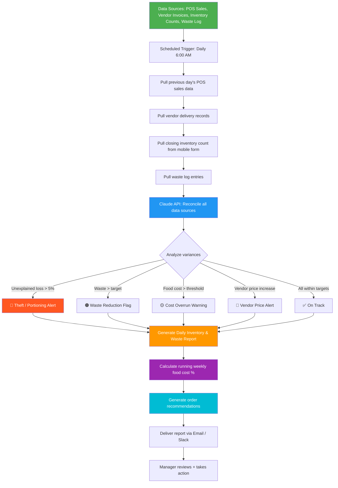

# Blueprint: Restaurant Manager — Automated Daily Inventory & Waste Tracking Report

**Role:** Restaurant Manager / Kitchen Manager / F&B Director
**Pain Point:** 10–15 hours per week spent manually counting inventory, logging waste, comparing vendor invoices, and calculating food cost percentages — often on paper or disconnected spreadsheets
**Time Saved:** ~10–12 hours/week
**Difficulty to Implement:** Low–Medium
**Tools Required:** Google Sheets or Airtable (inventory tracker), POS system export (Toast, Square, Clover), Claude API or any LLM API, Zapier/Make or a Python script, email or Slack for delivery

---

## The Problem

Restaurant managers live in a world of razor-thin margins. The average full-service restaurant operates on 3–9% net profit, which means that every pound of spoiled produce, every over-portioned entrée, and every miscounted case of chicken directly eats into the bottom line. The industry standard target for food cost is 28–35% of revenue, and the difference between a well-managed 30% and a sloppy 36% on a restaurant doing $40,000/week in sales is $2,400/week — over $120,000/year — walking out the back door.

Despite these stakes, most restaurant managers track inventory and waste using pen-and-paper clipboards, disconnected spreadsheets, or — in too many cases — gut instinct. The typical daily inventory workflow looks like this: walk through the walk-in cooler with a clipboard, count every item by hand, write it down, go to the dry storage area and repeat, then sit in the back office for 45 minutes entering numbers into a spreadsheet, manually cross-referencing yesterday's counts with today's POS sales data to figure out what was actually consumed versus what went to waste. Then compare that against vendor delivery invoices to make sure you weren't shorted. Then calculate the day's food cost percentage by hand.

This process takes 1.5–2.5 hours every single day. It's tedious, error-prone (miscounts are rampant at 6 AM or 11 PM), and the insights come too late — by the time the manager realizes that the kitchen burned through $400 of salmon in a single shift, the damage is already done.

The data that drives these calculations already exists in structured, digital formats: POS systems track every item sold, vendor portals have delivery invoices, and inventory counts can be digitized with a simple mobile form. The analysis step — reconciling sales, deliveries, waste, and counts into a coherent daily report with actionable alerts — is precisely the kind of structured reasoning that AI excels at.

This blueprint automates the entire daily inventory reconciliation and waste tracking pipeline, delivering a morning report that tells the manager exactly where money is being lost and what to do about it.

---

## Workflow Overview



---

## How It Works

### Step 1: Data Collection (Automated + 10-Minute Mobile Count)

The workflow pulls from four data sources. Three are fully automated; one requires a quick nightly closing count by a shift lead using a mobile form.

**Data sources and what gets extracted:**

| Source | Data Pulled | Format |
|--------|------------|--------|
| POS System (Toast / Square / Clover) | Every menu item sold, by quantity and time | API or CSV export |
| Vendor Portal (Sysco / US Foods / local) | Delivery invoices — items, quantities, unit prices | Email parse or API |
| Closing Inventory Count | On-hand quantities for top 30–50 key items | Google Form → Sheets |
| Waste Log | Items wasted, quantity, reason (spoiled, dropped, overcooked, etc.) | Google Form → Sheets |

The closing inventory count is the only manual step, and it's streamlined to take 10 minutes: the shift lead opens a Google Form on their phone, walks through the walk-in and dry storage, and enters counts for the 30–50 highest-value items (proteins, dairy, produce, alcohol). Low-value items like spices and condiments are counted weekly, not daily.

**Example raw data for one day:**

```json
{
  "date": "2026-03-29",
  "restaurant": "The Garden Table",
  "pos_sales": [
    {"item": "Grilled Salmon", "qty_sold": 34, "menu_price": 28.00, "food_cost_per_unit": 9.50},
    {"item": "Ribeye Steak", "qty_sold": 22, "menu_price": 42.00, "food_cost_per_unit": 14.75},
    {"item": "Caesar Salad", "qty_sold": 48, "menu_price": 14.00, "food_cost_per_unit": 3.20},
    {"item": "Pasta Primavera", "qty_sold": 29, "menu_price": 18.00, "food_cost_per_unit": 4.10},
    {"item": "Chocolate Lava Cake", "qty_sold": 19, "menu_price": 12.00, "food_cost_per_unit": 2.80}
  ],
  "total_revenue": 8742.00,
  "vendor_deliveries": [
    {"vendor": "Sysco", "invoice": "INV-88341", "total": 2180.50, "items": [
      {"item": "Atlantic Salmon (case)", "qty": 4, "unit_price": 89.50, "prev_price": 82.00},
      {"item": "Ribeye (case)", "qty": 3, "unit_price": 198.00, "prev_price": 198.00},
      {"item": "Romaine Hearts (case)", "qty": 6, "unit_price": 28.00, "prev_price": 28.00}
    ]},
    {"vendor": "Local Farm Co-op", "invoice": "LF-2291", "total": 340.00, "items": [
      {"item": "Mixed Greens (lb)", "qty": 20, "unit_price": 6.00, "prev_price": 5.50},
      {"item": "Heirloom Tomatoes (lb)", "qty": 15, "unit_price": 8.00, "prev_price": 8.00}
    ]}
  ],
  "closing_inventory": {
    "atlantic_salmon_lbs": 28,
    "ribeye_lbs": 18,
    "romaine_hearts": 14,
    "heavy_cream_qt": 8,
    "chocolate_bars": 22,
    "olive_oil_liters": 6
  },
  "opening_inventory": {
    "atlantic_salmon_lbs": 42,
    "ribeye_lbs": 31,
    "romaine_hearts": 22,
    "heavy_cream_qt": 12,
    "chocolate_bars": 28,
    "olive_oil_liters": 7
  },
  "waste_log": [
    {"item": "Atlantic Salmon", "qty": "3 lbs", "reason": "Spoiled — reached use-by date", "shift": "AM"},
    {"item": "Romaine Hearts", "qty": "2 heads", "reason": "Wilted/brown edges", "shift": "AM"},
    {"item": "Chocolate Lava Cake", "qty": "4 portions", "reason": "Overcooked — oven temp issue", "shift": "PM"},
    {"item": "Ribeye Steak", "qty": "1.5 lbs", "reason": "Customer return — overcooked", "shift": "PM"}
  ]
}
```

### Step 2: AI Reconciliation & Analysis (Automated)

The collected data is sent to the Claude API, which performs the reconciliation that a manager would normally do by hand — but faster, more accurately, and with pattern detection across days and weeks.

**Prompt template:**

```
You are a restaurant operations analyst. Given the following daily data for a restaurant,
perform a complete inventory reconciliation and produce a daily operations report.

For each key inventory item, calculate:
1. THEORETICAL USAGE: Opening inventory + deliveries received - closing inventory
2. ACTUAL USAGE FROM POS: Quantity sold × recipe amount per portion
3. VARIANCE: Theoretical usage - POS-based usage - logged waste
4. VARIANCE PERCENTAGE: Variance / theoretical usage × 100

Flag any item where:
- Unexplained variance exceeds 5% (possible portioning issue or theft)
- Waste exceeds 3% of that item's total usage
- Vendor price increased more than 5% from previous delivery
- Daily food cost percentage exceeds the target of {target_food_cost}%

Also provide:
- Overall daily food cost percentage (total food cost of items sold / total revenue)
- Running weekly food cost percentage (use the weekly data provided)
- Top 3 cost-saving recommendations based on today's data
- Suggested order quantities for tomorrow based on sales trend and current stock

Restaurant Data:
{daily_data_json}

Weekly Running Totals:
{weekly_data_json}

Target food cost: {target_food_cost}%
```

**Example output:**

### Step 3: Report Generation (Automated)

The AI produces a structured daily report delivered to the manager's inbox or Slack channel before the morning shift begins.

**Example Daily Report:**

```
═══════════════════════════════════════════════════════════════
            DAILY INVENTORY & WASTE REPORT
                The Garden Table
              Monday, March 30, 2026
           (Reporting on Sunday, March 29)
═══════════════════════════════════════════════════════════════

💰 DAILY FINANCIAL SNAPSHOT
─────────────────────────────
  Total Revenue:           $8,742.00
  Total Food Cost:         $2,755.30
  Daily Food Cost %:       31.5%     [TARGET: 30%] 🟡
  Weekly Running Avg:      30.2%     ✅

📊 KEY ITEM RECONCILIATION
─────────────────────────────

  ATLANTIC SALMON
  ┌──────────────────────────────────────────────┐
  │ Opening Stock:          42 lbs               │
  │ + Delivered:            32 lbs (4 cases)     │
  │ - Closing Stock:        28 lbs               │
  │ = Theoretical Usage:    46 lbs               │
  │                                              │
  │ POS Usage (34 sold):    40.8 lbs             │
  │ Logged Waste:           3 lbs (spoiled)      │
  │ Accounted For:          43.8 lbs             │
  │                                              │
  │ 🔴 UNEXPLAINED VARIANCE: 2.2 lbs (4.8%)    │
  │ → Likely over-portioning. Each salmon dish   │
  │   is spec'd at 6oz; actual avg = 6.4oz       │
  │   Cost impact: $20.90/day ($146/week)        │
  └──────────────────────────────────────────────┘

  RIBEYE STEAK
  ┌──────────────────────────────────────────────┐
  │ Opening Stock:          31 lbs               │
  │ + Delivered:            24 lbs (3 cases)     │
  │ - Closing Stock:        18 lbs               │
  │ = Theoretical Usage:    37 lbs               │
  │                                              │
  │ POS Usage (22 sold):    33 lbs               │
  │ Logged Waste:           1.5 lbs (return)     │
  │ Accounted For:          34.5 lbs             │
  │                                              │
  │ 🟡 VARIANCE: 2.5 lbs (6.8%)                │
  │ → Check trim waste — may need to log         │
  │   butchering trim separately                 │
  │   Cost impact: $36.88/day ($258/week)        │
  └──────────────────────────────────────────────┘

  ROMAINE HEARTS                          ✅ Within tolerance (1.2% variance)
  HEAVY CREAM                             ✅ Within tolerance (0.8% variance)
  CHOCOLATE BARS                          ✅ Within tolerance (2.1% variance)

🔵 VENDOR PRICE ALERTS
─────────────────────────
  ⚠️  Atlantic Salmon (Sysco): $89.50/case → was $82.00 (+9.1%)
      Annual impact at current volume: +$1,560/year
      → RECOMMENDATION: Request quote from Pacific Seafood Co. or
        lock in price with 30-day contract

  ⚠️  Mixed Greens (Local Farm Co-op): $6.00/lb → was $5.50 (+9.1%)
      Annual impact: +$520/year
      → Seasonal increase — likely temporary. Monitor.

🗑️ WASTE SUMMARY
──────────────────
  Total Waste Value:        $67.40
  Waste as % of Revenue:    0.77%   [TARGET: < 1%] ✅

  Breakdown:
  ┌────────────────────────┬──────┬──────────┬────────────────────┐
  │ Item                   │ Qty  │ Cost     │ Reason             │
  ├────────────────────────┼──────┼──────────┼────────────────────┤
  │ Atlantic Salmon        │ 3 lb │ $28.50   │ Spoiled — use-by   │
  │ Chocolate Lava Cake    │ 4 ea │ $11.20   │ Overcooked (oven)  │
  │ Romaine Hearts         │ 2 hd │ $9.33    │ Wilted             │
  │ Ribeye Steak           │ 1.5lb│ $18.37   │ Customer return     │
  └────────────────────────┴──────┴──────────┴────────────────────┘

  💡 Pattern detected: Salmon spoilage logged 3 of last 5 days.
     Consider reducing standing order from 4 cases to 3 cases on
     low-volume days (Mon–Wed) and implementing FIFO labels.

  💡 Oven temperature issue caused $11.20 in dessert waste.
     Schedule maintenance check this week.

📦 SUGGESTED ORDERS FOR TOMORROW
──────────────────────────────────
  Based on Monday sales trends (avg 15% lower than Sunday)
  and current stock levels:

  │ Item              │ On Hand │ Projected Need │ Order? │
  │───────────────────│─────────│────────────────│────────│
  │ Atlantic Salmon   │ 28 lbs  │ 24 lbs         │ No     │
  │ Ribeye            │ 18 lbs  │ 19 lbs         │ 1 case │
  │ Romaine Hearts    │ 14      │ 10             │ No     │
  │ Heavy Cream       │ 8 qt    │ 6 qt           │ No     │
  │ Chocolate Bars    │ 22      │ 8              │ No     │

🎯 TOP 3 ACTION ITEMS
───────────────────────
  1. ADDRESS SALMON PORTIONING — 2.2 lbs/day unexplained variance
     is costing ~$146/week. Retrain line cooks on 6oz portion
     using a kitchen scale during plating. Post visual portion
     guide at the station.

  2. CALL SYSCO RE: SALMON PRICING — 9.1% price increase on
     your highest-volume protein. Get a competing quote before
     your next order on Wednesday.

  3. SCHEDULE OVEN MAINTENANCE — PM shift reported temperature
     inconsistency causing dessert waste. Preventive maintenance
     is cheaper than wasted inventory.

═══════════════════════════════════════════════════════════════
  Report generated automatically at 6:00 AM
  Data sources: Toast POS, Sysco Portal, Daily Count Form
  Next report: Tomorrow, 6:00 AM
═══════════════════════════════════════════════════════════════
```

### Step 4: Weekly Rollup (Automated, Every Monday)

In addition to the daily report, the workflow generates a weekly summary every Monday morning that aggregates the full week's data into executive-level insights.

**Weekly rollup includes:**
- 7-day food cost trend with daily breakdown
- Total waste by category with week-over-week comparison
- Highest-variance items (persistent portioning or theft issues)
- Vendor spend analysis with price trend warnings
- Projected vs. actual food cost for the week
- Suggested menu engineering changes (e.g., "Ribeye food cost is 35.1% — consider a $2 price increase or reducing the portion from 12oz to 10oz")

### Step 5: Manager Action (Manual — 10 minutes)

The manager's morning routine transforms from a 90-minute data-crunching exercise into a 10-minute action-oriented review: scan the report, address the flagged items, and move on to running the restaurant.

---

## Implementation Guide

### Option A: No-Code (Google Sheets + Zapier + Claude API)

**Setup time:** 3–4 hours

1. **Set up a Google Form for nightly inventory counts** — the shift lead opens it on their phone and enters counts for your top 30–50 items. Takes 10 minutes.
2. **Set up a Google Form for waste logging** — kitchen staff log waste items throughout the shift with item, quantity, and reason.
3. **Export POS data to Google Sheets** — most POS systems (Toast, Square, Clover) support automatic daily exports via Zapier or native integrations.
4. **Create a Zapier automation:**
   - Trigger: Schedule — Every day at 6:00 AM
   - Action 1: Google Sheets — Pull yesterday's POS sales summary
   - Action 2: Google Sheets — Pull closing inventory counts
   - Action 3: Google Sheets — Pull waste log entries
   - Action 4: Gmail — Search for vendor invoices received yesterday (parse with Zapier formatter)
   - Action 5: Claude API — Send all data with the analysis prompt above
   - Action 6: Gmail or Slack — Send the generated report to the manager
5. **Cost:** ~$25–40/month (Zapier + Claude API)

### Option B: Python Script (More Control)

**Setup time:** 4–5 hours

```python
import json
import csv
from datetime import datetime, timedelta
from anthropic import Anthropic

client = Anthropic()

def pull_pos_data(date, pos_export_path):
    """Load POS sales data from daily export CSV."""
    sales = []
    with open(pos_export_path, 'r') as f:
        reader = csv.DictReader(f)
        for row in reader:
            if row['date'] == date:
                sales.append({
                    'item': row['menu_item'],
                    'qty_sold': int(row['quantity']),
                    'menu_price': float(row['price']),
                    'food_cost_per_unit': float(row['food_cost'])
                })
    return sales


def pull_inventory_counts(date, inventory_path):
    """Load closing inventory counts from Google Sheets export."""
    counts = {}
    with open(inventory_path, 'r') as f:
        reader = csv.DictReader(f)
        for row in reader:
            if row['date'] == date:
                counts[row['item']] = float(row['quantity'])
    return counts


def pull_waste_log(date, waste_path):
    """Load waste log entries for the day."""
    entries = []
    with open(waste_path, 'r') as f:
        reader = csv.DictReader(f)
        for row in reader:
            if row['date'] == date:
                entries.append({
                    'item': row['item'],
                    'qty': row['quantity'],
                    'reason': row['reason'],
                    'shift': row['shift']
                })
    return entries


def pull_vendor_deliveries(date, invoices_path):
    """Load vendor delivery invoices."""
    deliveries = []
    with open(invoices_path, 'r') as f:
        reader = csv.DictReader(f)
        for row in reader:
            if row['delivery_date'] == date:
                deliveries.append({
                    'vendor': row['vendor'],
                    'item': row['item'],
                    'qty': float(row['quantity']),
                    'unit_price': float(row['unit_price']),
                    'prev_price': float(row.get('previous_price', row['unit_price']))
                })
    return deliveries


def get_weekly_running_totals(end_date, pos_export_path):
    """Calculate running weekly food cost totals."""
    weekly_revenue = 0
    weekly_food_cost = 0
    end = datetime.strptime(end_date, '%Y-%m-%d')

    for i in range(7):
        day = (end - timedelta(days=i)).strftime('%Y-%m-%d')
        daily_sales = pull_pos_data(day, pos_export_path)
        for item in daily_sales:
            weekly_revenue += item['qty_sold'] * item['menu_price']
            weekly_food_cost += item['qty_sold'] * item['food_cost_per_unit']

    return {
        'weekly_revenue': round(weekly_revenue, 2),
        'weekly_food_cost': round(weekly_food_cost, 2),
        'weekly_food_cost_pct': round(
            (weekly_food_cost / weekly_revenue * 100) if weekly_revenue > 0 else 0, 1
        )
    }


def generate_daily_report(daily_data, weekly_data, target_food_cost=30):
    """Send all data to Claude API for reconciliation and report generation."""
    prompt = f"""You are a restaurant operations analyst. Given the following daily data,
perform a complete inventory reconciliation and produce a daily operations report.

For each key inventory item, calculate:
1. THEORETICAL USAGE: Opening inventory + deliveries - closing inventory
2. ACTUAL USAGE FROM POS: Quantity sold × recipe amount per portion
3. VARIANCE: Theoretical usage - POS-based usage - logged waste
4. VARIANCE PERCENTAGE: Variance / theoretical usage × 100

Flag any item where:
- Unexplained variance exceeds 5% (portioning issue or theft)
- Waste exceeds 3% of total usage
- Vendor price increased more than 5%
- Daily food cost % exceeds {target_food_cost}%

Provide:
- Daily and weekly running food cost percentages
- Top 3 cost-saving action items
- Suggested order quantities for tomorrow
- Waste pattern analysis

Format as a clean, scannable text report a busy restaurant manager
can review in under 10 minutes.

Restaurant Data:
{json.dumps(daily_data, indent=2)}

Weekly Running Totals:
{json.dumps(weekly_data, indent=2)}

Target food cost: {target_food_cost}%"""

    response = client.messages.create(
        model="claude-sonnet-4-6",
        max_tokens=3000,
        messages=[{"role": "user", "content": prompt}]
    )
    return response.content[0].text


def main():
    yesterday = (datetime.now() - timedelta(days=1)).strftime('%Y-%m-%d')

    # Collect all data sources
    daily_data = {
        'date': yesterday,
        'pos_sales': pull_pos_data(yesterday, 'data/pos_sales.csv'),
        'closing_inventory': pull_inventory_counts(yesterday, 'data/inventory_counts.csv'),
        'opening_inventory': pull_inventory_counts(
            (datetime.strptime(yesterday, '%Y-%m-%d') - timedelta(days=1)).strftime('%Y-%m-%d'),
            'data/inventory_counts.csv'
        ),
        'waste_log': pull_waste_log(yesterday, 'data/waste_log.csv'),
        'vendor_deliveries': pull_vendor_deliveries(yesterday, 'data/invoices.csv')
    }

    weekly_data = get_weekly_running_totals(yesterday, 'data/pos_sales.csv')

    # Generate report
    report = generate_daily_report(daily_data, weekly_data, target_food_cost=30)

    # Save report
    report_filename = f"daily_report_{yesterday}.md"
    with open(report_filename, 'w') as f:
        f.write(report)

    # Also print for immediate review
    print(report)
    print(f"\n✅ Report saved to {report_filename}")


if __name__ == '__main__':
    main()
```

---

## Why This Should Be Implemented

**For the restaurant manager:** Transform a daily 90-minute chore into a 10-minute review. Instead of crunching numbers in the back office, you walk in each morning to a clear report that tells you exactly where money is leaking and what to do about it. You become proactive instead of reactive.

**For the owner / operator:** Visibility into food cost that was previously impossible without a full-time controller. The automated variance detection catches over-portioning, spoilage patterns, and vendor price creep in real time — not at the end of the month when it's too late. On a $2M/year restaurant, bringing food cost from 33% to 30% saves $60,000 annually.

**For the kitchen team:** Clear portion standards backed by data, not guesswork. When the report shows that salmon portioning is costing an extra $146/week, the conversation with the line cooks is specific and constructive: "We need to hit 6oz portions — here's a visual guide." No blame, just data.

**For the supply chain:** Smarter ordering based on actual sales trends and current stock levels, rather than the "same order every week" approach that leads to over-ordering and waste. The AI-generated order suggestions factor in day-of-week sales patterns, current inventory, and shelf life.

---

## Cost Estimate

| Component | Monthly Cost | Notes |
|-----------|-------------|-------|
| Claude API | $10–25 | Daily analysis of ~50 items × 30 days |
| Zapier (if using no-code) | $20 | Starter plan for POS + Sheets integrations |
| Google Workspace | $0–12 | Forms for counting + Sheets for data |
| POS data export | $0 | Most POS systems include CSV/API export |
| **Total** | **$10–57/month** | Pays for itself if it catches even one week of over-portioning |

**ROI example:** A restaurant doing $30,000/week in revenue with a 2% food cost improvement saves $600/week — $31,200/year — from a tool that costs under $700/year.

---

## Getting Started Checklist

- [ ] Identify your top 30–50 highest-value inventory items (proteins, dairy, expensive produce, alcohol)
- [ ] Set up a Google Form for nightly closing counts — keep it simple, one field per item
- [ ] Set up a Google Form for waste logging — fields: item, quantity, reason, shift
- [ ] Export one week of POS sales data and format it as a CSV
- [ ] Gather your last 3–4 vendor invoices to establish baseline prices
- [ ] Create recipe cards with exact portion sizes and ingredient amounts per dish
- [ ] Set up a Claude API key at console.anthropic.com
- [ ] Choose your implementation path (no-code or Python)
- [ ] Run a pilot for one week tracking only your top 10 items
- [ ] Review the AI-generated reports for accuracy against your manual counts
- [ ] Expand to full item list and share with your kitchen leads
- [ ] Set up the Monday weekly rollup automation

---

*Blueprint created: March 30, 2026*
*Category: Food & Beverage — Restaurant Operations*
*Estimated implementation time: 3–5 hours*
