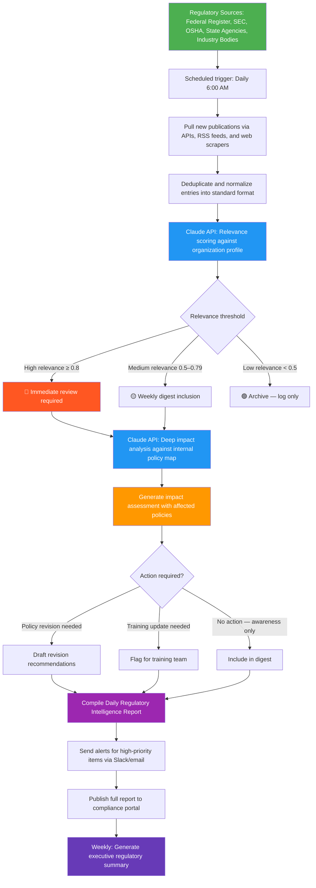

# Blueprint: Compliance Officer — Automated Regulatory Change Monitoring & Policy Impact Assessment Report

**Role:** Compliance Officer / Regulatory Affairs Analyst
**Pain Point:** 15–20 hours per week spent manually scanning regulatory sources, federal registers, industry bulletins, and enforcement actions to identify changes that affect the organization — then cross-referencing each change against internal policies to determine impact
**Time Saved:** ~12–15 hours/week
**Difficulty to Implement:** Medium
**Tools Required:** Web scraping or RSS feeds (Federal Register API, SEC EDGAR, state agency feeds), Claude API or any LLM API, Python or n8n/Make for orchestration, Notion/SharePoint/Google Docs for output, Slack or email for alerts

---

## The Problem

Compliance officers are the silent guardians of every regulated business — financial services, healthcare, manufacturing, food & beverage, energy, tech, and beyond. Their job is to ensure the organization stays on the right side of an ever-shifting regulatory landscape. The problem? That landscape shifts constantly.

On any given week, a compliance officer at a mid-size financial services firm might need to monitor the Federal Register for new SEC proposed rules, track CFPB enforcement actions, scan state-level banking commission bulletins across 15 states, review FINRA regulatory notices, check for updates to BSA/AML guidance from FinCEN, and watch for relevant court decisions. In healthcare, swap those for CMS updates, HIPAA guidance, state health department bulletins, and FDA safety communications. In manufacturing, think OSHA standards, EPA regulations, and state environmental agency updates.

The manual process looks like this every morning: open 8–15 browser tabs of regulatory source websites, scan headlines and summaries, identify items potentially relevant to the organization, download or bookmark the full text, read each item carefully, determine which internal policies or procedures are affected, draft an impact summary, flag items requiring immediate action, and compile everything into a weekly regulatory update for leadership. For items requiring policy changes, the officer must then draft revision recommendations, route them for review, and track implementation.

This is tedious, error-prone work. Miss one bulletin — especially an enforcement action in your industry — and the organization faces real risk: fines, sanctions, reputational damage, or worse. But the volume of regulatory output is staggering. The Federal Register alone publishes 70,000+ pages per year. No human can reliably process this firehose and still have time for the strategic work that actually prevents compliance failures.

The data is structured, the pattern recognition is systematic, and the output is templated. This is a textbook automation candidate.

---

## Workflow Overview



---

## How It Works

### Step 1: Source Monitoring & Data Collection (Automated — Daily at 6:00 AM)

The workflow pulls from all regulatory sources relevant to the organization. No manual browsing required — it works with APIs, RSS feeds, and targeted web scraping.

**Data sources and extraction methods:**

| Source | Method | What Gets Pulled |
|--------|--------|-----------------|
| Federal Register | Official API (federalregister.gov/api) | New rules, proposed rules, notices by agency |
| SEC / FINRA | RSS + EDGAR API | Regulatory releases, enforcement actions, no-action letters |
| OSHA / EPA | RSS feeds + web scrape | Standards updates, enforcement guidance, penalty actions |
| State Agencies | Web scrape (configurable per state) | New regulations, enforcement orders, guidance letters |
| Industry Bodies | RSS + email parsing | Best practice updates, self-regulatory changes |
| Court Decisions | Legal database API (CourtListener / Westlaw) | Decisions affecting regulatory interpretation |

**Example raw entry (normalized):**

```json
{
  "source": "Federal Register",
  "agency": "SEC",
  "document_type": "Proposed Rule",
  "title": "Enhanced Cybersecurity Risk Management for Broker-Dealers",
  "publication_date": "2026-05-12",
  "federal_register_number": "2026-10847",
  "summary": "The Securities and Exchange Commission proposes amendments to Regulation S-P requiring broker-dealers and investment advisers to adopt incident response programs and notify affected individuals within 30 days of a cybersecurity incident...",
  "effective_date": null,
  "comment_deadline": "2026-07-15",
  "full_text_url": "https://www.federalregister.gov/documents/2026/05/12/2026-10847/...",
  "agencies_affected": ["SEC", "FINRA"],
  "cfr_references": ["17 CFR 248"]
}
```

### Step 2: Relevance Scoring (AI-Powered)

Each entry is evaluated against an **Organization Profile** — a configuration file that describes the company's industry, lines of business, jurisdictions, and regulatory frameworks. The AI assigns a relevance score from 0.0 to 1.0.

**Organization Profile example:**

```yaml
organization:
  name: "Apex Financial Services"
  industry: "Financial Services"
  sub_sectors:
    - "Retail Brokerage"
    - "Investment Advisory"
    - "Wealth Management"
  jurisdictions:
    - "Federal (SEC, FINRA, FinCEN)"
    - "New York (DFS)"
    - "California (DFPI)"
    - "Texas (TSSB)"
  regulatory_frameworks:
    - "Securities Exchange Act of 1934"
    - "Investment Advisers Act of 1940"
    - "Bank Secrecy Act / AML"
    - "Regulation S-P (Privacy)"
    - "Regulation Best Interest"
    - "FINRA Rules 3110, 3120, 4370"
  high_priority_topics:
    - "Cybersecurity"
    - "AML / BSA"
    - "Fiduciary duty"
    - "Customer data privacy"
    - "ESG disclosure"
  employee_count: 850
  aum: "$12B"
```

**Prompt template for relevance scoring:**

```
You are a regulatory compliance analyst. Given the following regulatory 
publication and organization profile, score the relevance from 0.0 to 1.0 
and explain your reasoning in 2-3 sentences.

Scoring guide:
- 0.8–1.0: Directly affects the organization's operations, requires action
- 0.5–0.79: Related to the organization's industry, worth monitoring
- 0.2–0.49: Tangentially related, archive for reference
- 0.0–0.19: Not relevant to this organization

[PUBLICATION DATA]
[ORGANIZATION PROFILE]

Return JSON: {"score": float, "reasoning": string, "affected_areas": [string]}
```

### Step 3: Deep Impact Analysis (AI-Powered — High & Medium Relevance Only)

For items scoring ≥ 0.5, the workflow runs a second, deeper analysis that cross-references the regulatory change against the organization's **Internal Policy Map** — a structured inventory of all compliance policies, procedures, and controls.

**Internal Policy Map excerpt:**

```json
{
  "policies": [
    {
      "id": "POL-CYBER-001",
      "title": "Cybersecurity Incident Response Plan",
      "last_updated": "2025-11-15",
      "owner": "CISO / Compliance",
      "regulatory_basis": ["Reg S-P", "FINRA Rule 4370", "NY DFS 500"],
      "key_provisions": [
        "72-hour incident notification to regulators",
        "Annual penetration testing",
        "Vendor risk assessment for critical systems"
      ],
      "next_review_date": "2026-05-30"
    },
    {
      "id": "POL-AML-003",
      "title": "Anti-Money Laundering Program",
      "last_updated": "2026-01-10",
      "owner": "BSA Officer",
      "regulatory_basis": ["BSA", "FinCEN CDD Rule", "FINRA Rule 3310"],
      "key_provisions": [
        "Customer due diligence at account opening",
        "Suspicious activity monitoring and SAR filing",
        "OFAC screening"
      ],
      "next_review_date": "2026-07-10"
    }
  ]
}
```

**Impact analysis prompt:**

```
You are a senior compliance officer. Analyze how this regulatory change 
impacts the organization's existing policies and controls.

For each affected policy, provide:
1. Policy ID and title
2. Specific provisions that need updating
3. Gap analysis: what the current policy says vs. what the new regulation requires
4. Recommended action (revise policy, update procedure, training, no action)
5. Urgency: Immediate / 30-day / 90-day / Next scheduled review
6. Estimated effort: Hours to implement the change

[REGULATORY CHANGE DETAILS]
[INTERNAL POLICY MAP]
[ORGANIZATION PROFILE]
```

**Example output:**

```json
{
  "regulatory_change": "SEC Proposed Rule — Enhanced Cybersecurity for Broker-Dealers",
  "overall_impact": "HIGH",
  "affected_policies": [
    {
      "policy_id": "POL-CYBER-001",
      "policy_title": "Cybersecurity Incident Response Plan",
      "impact_level": "HIGH",
      "gap_analysis": "Current policy requires 72-hour notification to regulators. Proposed rule adds mandatory 30-day notification to affected individuals — not currently addressed in our plan. Also requires written incident response procedures to be filed with the SEC, which we do not currently do.",
      "recommended_action": "Revise policy to add individual notification procedures, establish 30-day notification workflow, prepare SEC filing template",
      "urgency": "30-day (comment period open — submit comments by July 15, prepare for implementation)",
      "estimated_effort_hours": 24,
      "assigned_to": "CISO + Compliance Team"
    }
  ],
  "comment_opportunity": {
    "deadline": "2026-07-15",
    "recommended": true,
    "suggested_topics": [
      "30-day individual notification timeline may be impractical for complex breaches",
      "Clarification needed on scope of 'affected individuals' for attempted breaches"
    ]
  }
}
```

### Step 4: Report Generation (Automated)

The workflow compiles all analyzed items into a structured **Daily Regulatory Intelligence Report** and a **Weekly Executive Summary**.

**Daily Report structure:**

```markdown
# Regulatory Intelligence Report — May 13, 2026

## 🔴 IMMEDIATE ATTENTION (2 items)

### 1. SEC Proposed Rule: Enhanced Cybersecurity for Broker-Dealers
- **Source:** Federal Register 2026-10847
- **Relevance Score:** 0.95
- **Impact:** HIGH — Affects POL-CYBER-001 (Incident Response Plan)
- **Key Change:** Mandatory 30-day individual notification + SEC filing requirement
- **Action Required:** Policy revision needed within 30 days
- **Comment Deadline:** July 15, 2026
- **Owner:** CISO / Compliance Team
- **[Full Analysis →]**

### 2. FINRA Enforcement: $2.1M Fine — Broker-Dealer AML Failures
- **Source:** FINRA Disciplinary Actions
- **Relevance Score:** 0.88
- **Impact:** MEDIUM — Review POL-AML-003 against cited deficiencies
- **Key Takeaway:** Firm fined for inadequate suspicious activity monitoring 
  in omnibus accounts — relevant to our clearing operations
- **Action Required:** Self-assessment of omnibus account monitoring procedures
- **Owner:** BSA Officer
- **[Full Analysis →]**

## 🟡 WEEKLY DIGEST ITEMS (5 items)
[Summarized entries with scores 0.5–0.79]

## 📊 Regulatory Pulse
- **Items scanned today:** 47
- **Relevant items identified:** 7
- **Actions generated:** 3
- **Open comment periods:** 4 (2 closing within 30 days)
- **Policies flagged for review:** 2
```

### Step 5: Alerting & Distribution (Automated)

High-priority items trigger immediate Slack/email alerts. The full report is published to the compliance portal.

**Alert routing rules:**

| Priority | Channel | Timing |
|----------|---------|--------|
| 🔴 Score ≥ 0.8 + action required | Slack DM to Compliance Officer + email to CCO | Immediately |
| 🔴 Enforcement action in our sector | Slack #compliance-alerts channel | Immediately |
| 🟡 Score 0.5–0.79 | Included in daily digest email | 8:00 AM |
| 🟢 Score < 0.5 | Logged to regulatory archive | No alert |
| Weekly summary | Email to C-suite + board compliance committee | Monday 7:00 AM |

---

## Implementation Guide

### Option A: Python + Claude API (Most Flexible)

```python
import anthropic
import requests
import json
import yaml
from datetime import datetime, timedelta

client = anthropic.Anthropic()

# --- Step 1: Pull from Federal Register API ---
def fetch_federal_register(agencies, lookback_days=1):
    """Pull recent documents from the Federal Register API."""
    base_url = "https://www.federalregister.gov/api/v1/documents.json"
    date_from = (datetime.now() - timedelta(days=lookback_days)).strftime("%m/%d/%Y")
    
    all_documents = []
    for agency_slug in agencies:
        params = {
            "conditions[agencies][]": agency_slug,
            "conditions[publication_date][gte]": date_from,
            "fields[]": [
                "title", "type", "abstract", "document_number",
                "publication_date", "agencies", "cfr_references",
                "comment_end_date", "effective_on", "html_url"
            ],
            "per_page": 50,
            "order": "newest"
        }
        response = requests.get(base_url, params=params)
        if response.status_code == 200:
            results = response.json().get("results", [])
            for doc in results:
                all_documents.append({
                    "source": "Federal Register",
                    "agency": ", ".join(
                        [a["name"] for a in doc.get("agencies", [])]
                    ),
                    "document_type": doc.get("type", "Unknown"),
                    "title": doc.get("title", ""),
                    "publication_date": doc.get("publication_date", ""),
                    "document_number": doc.get("document_number", ""),
                    "summary": doc.get("abstract", ""),
                    "comment_deadline": doc.get("comment_end_date"),
                    "effective_date": doc.get("effective_on"),
                    "full_text_url": doc.get("html_url", ""),
                    "cfr_references": doc.get("cfr_references", [])
                })
    return all_documents

# --- Step 2: Score relevance ---
def score_relevance(document, org_profile):
    """Use Claude to score regulatory relevance against org profile."""
    prompt = f"""You are a regulatory compliance analyst. Score the relevance 
of this regulatory publication to the organization described below.

PUBLICATION:
{json.dumps(document, indent=2)}

ORGANIZATION PROFILE:
{json.dumps(org_profile, indent=2)}

Score from 0.0 to 1.0:
- 0.8-1.0: Directly affects operations, requires action
- 0.5-0.79: Industry-related, worth monitoring  
- 0.2-0.49: Tangentially related
- 0.0-0.19: Not relevant

Return valid JSON only:
{{"score": float, "reasoning": "string", "affected_areas": ["string"]}}"""

    response = client.messages.create(
        model="claude-sonnet-4-6",
        max_tokens=500,
        messages=[{"role": "user", "content": prompt}]
    )
    return json.loads(response.content[0].text)

# --- Step 3: Deep impact analysis ---
def analyze_impact(document, org_profile, policy_map):
    """Deep analysis of how a regulatory change impacts internal policies."""
    prompt = f"""You are a senior compliance officer. Analyze how this 
regulatory change impacts the organization's existing policies.

REGULATORY CHANGE:
{json.dumps(document, indent=2)}

ORGANIZATION PROFILE:
{json.dumps(org_profile, indent=2)}

INTERNAL POLICY MAP:
{json.dumps(policy_map, indent=2)}

For each affected policy provide:
1. Policy ID and title
2. Specific provisions needing updates
3. Gap analysis (current vs. required)
4. Recommended action
5. Urgency (Immediate / 30-day / 90-day / Next review)
6. Estimated effort in hours

Return valid JSON with "affected_policies" array and "comment_opportunity" object."""

    response = client.messages.create(
        model="claude-sonnet-4-6",
        max_tokens=2000,
        messages=[{"role": "user", "content": prompt}]
    )
    return json.loads(response.content[0].text)

# --- Step 4: Generate report ---
def generate_daily_report(analyses, date_str):
    """Compile all analyses into the daily intelligence report."""
    immediate = [a for a in analyses if a["relevance"]["score"] >= 0.8]
    digest = [
        a for a in analyses 
        if 0.5 <= a["relevance"]["score"] < 0.8
    ]
    archived = [a for a in analyses if a["relevance"]["score"] < 0.5]
    
    report = f"# Regulatory Intelligence Report — {date_str}\n\n"
    
    if immediate:
        report += f"## 🔴 IMMEDIATE ATTENTION ({len(immediate)} items)\n\n"
        for i, item in enumerate(immediate, 1):
            report += f"### {i}. {item['document']['title']}\n"
            report += f"- **Source:** {item['document']['source']} "
            report += f"{item['document'].get('document_number', '')}\n"
            report += f"- **Relevance Score:** {item['relevance']['score']}\n"
            report += f"- **Reasoning:** {item['relevance']['reasoning']}\n"
            if item.get("impact"):
                for policy in item["impact"].get("affected_policies", []):
                    report += f"- **Affects:** {policy['policy_id']} — "
                    report += f"{policy['policy_title']}\n"
                    report += f"- **Action:** {policy['recommended_action']}\n"
                    report += f"- **Urgency:** {policy['urgency']}\n"
            report += "\n"
    
    if digest:
        report += f"## 🟡 WEEKLY DIGEST ({len(digest)} items)\n\n"
        for item in digest:
            report += f"- **{item['document']['title']}** "
            report += f"(Score: {item['relevance']['score']}) — "
            report += f"{item['relevance']['reasoning']}\n"
        report += "\n"
    
    report += "## 📊 Regulatory Pulse\n"
    total = len(immediate) + len(digest) + len(archived)
    report += f"- **Items scanned:** {total}\n"
    report += f"- **High priority:** {len(immediate)}\n"
    report += f"- **Digest items:** {len(digest)}\n"
    report += f"- **Archived:** {len(archived)}\n"
    
    return report

# --- Main orchestration ---
def run_daily_scan():
    """Main entry point — run the full daily regulatory scan."""
    with open("org_profile.yaml", "r") as f:
        org_profile = yaml.safe_load(f)
    with open("policy_map.json", "r") as f:
        policy_map = json.load(f)
    
    # Configure your monitored agencies (Federal Register slugs)
    agencies = [
        "securities-and-exchange-commission",
        "consumer-financial-protection-bureau",
        "financial-crimes-enforcement-network",
        "commodity-futures-trading-commission"
    ]
    
    # Step 1: Fetch
    documents = fetch_federal_register(agencies, lookback_days=1)
    print(f"Fetched {len(documents)} documents from Federal Register")
    
    # Step 2 & 3: Score and analyze
    analyses = []
    for doc in documents:
        relevance = score_relevance(doc, org_profile)
        impact = None
        if relevance["score"] >= 0.5:
            impact = analyze_impact(doc, org_profile, policy_map)
        analyses.append({
            "document": doc,
            "relevance": relevance,
            "impact": impact
        })
    
    # Step 4: Generate report
    today = datetime.now().strftime("%B %d, %Y")
    report = generate_daily_report(analyses, today)
    
    filename = f"reg-intel-{datetime.now().strftime('%Y-%m-%d')}.md"
    with open(filename, "w") as f:
        f.write(report)
    print(f"Report saved: {filename}")
    
    # Step 5: Alert on high-priority items
    high_priority = [
        a for a in analyses if a["relevance"]["score"] >= 0.8
    ]
    if high_priority:
        send_slack_alert(high_priority)
        send_email_alert(high_priority)
    
    return report

if __name__ == "__main__":
    run_daily_scan()
```

### Option B: n8n / Make (No-Code)

For compliance teams without engineering support:

1. **HTTP Request nodes** → pull from Federal Register API, RSS feeds for SEC/FINRA/OSHA
2. **Merge + Deduplication node** → combine all sources, deduplicate by document number
3. **Claude/OpenAI node** → relevance scoring with org profile in system prompt
4. **Filter node** → split into high/medium/low priority paths
5. **Claude/OpenAI node (second pass)** → deep impact analysis for high/medium items
6. **Google Docs / Notion node** → write daily report
7. **Slack / Gmail node** → send alerts for high-priority items
8. **Google Sheets node** → log all scanned items to regulatory tracking spreadsheet

---

## Visual Example: Daily Regulatory Intelligence Report

Below is what the compliance officer receives every morning at 8:00 AM:

```
╔══════════════════════════════════════════════════════════════════╗
║         REGULATORY INTELLIGENCE REPORT — May 13, 2026          ║
║         Apex Financial Services | Compliance Division          ║
╠══════════════════════════════════════════════════════════════════╣
║                                                                ║
║  📊 TODAY'S SCAN SUMMARY                                      ║
║  ┌─────────────────────────────────────────────────────────┐   ║
║  │  Sources scanned:        12                             │   ║
║  │  Documents reviewed:     47                             │   ║
║  │  🔴 Immediate action:     2                             │   ║
║  │  🟡 Digest items:         5                             │   ║
║  │  🟢 Archived:            40                             │   ║
║  │  Open comment periods:    4 (2 closing < 30 days)       │   ║
║  └─────────────────────────────────────────────────────────┘   ║
║                                                                ║
║  🔴 IMMEDIATE ATTENTION                                       ║
║  ━━━━━━━━━━━━━━━━━━━━━━━━━━━━━━━━━━━━━━━━━━━━━━━━━━━━━━━━━   ║
║                                                                ║
║  1. SEC Proposed Rule: Enhanced Cybersecurity Requirements     ║
║     ┌──────────────────────────────────────────────────────┐   ║
║     │ Relevance: ████████████████████░░ 0.95               │   ║
║     │ Impact:    HIGH                                      │   ║
║     │ Source:    Federal Register 2026-10847                │   ║
║     │ Comment by: July 15, 2026 (63 days)                  │   ║
║     ├──────────────────────────────────────────────────────┤   ║
║     │ AFFECTED POLICIES:                                   │   ║
║     │  → POL-CYBER-001: Incident Response Plan             │   ║
║     │    Gap: No individual notification procedure         │   ║
║     │    Action: Revise policy, add 30-day notification    │   ║
║     │    Effort: ~24 hours | Urgency: 30-day               │   ║
║     │    Owner: CISO + Compliance                          │   ║
║     ├──────────────────────────────────────────────────────┤   ║
║     │ RECOMMENDATION: Submit comments on proposed rule.    │   ║
║     │ Key concern: 30-day individual notification timeline │   ║
║     │ may be impractical for complex multi-vector breaches.│   ║
║     └──────────────────────────────────────────────────────┘   ║
║                                                                ║
║  2. FINRA Enforcement: $2.1M AML Fine — Broker-Dealer         ║
║     ┌──────────────────────────────────────────────────────┐   ║
║     │ Relevance: ██████████████████░░░░ 0.88               │   ║
║     │ Impact:    MEDIUM                                    │   ║
║     │ Source:    FINRA Disciplinary Actions                 │   ║
║     ├──────────────────────────────────────────────────────┤   ║
║     │ AFFECTED POLICIES:                                   │   ║
║     │  → POL-AML-003: AML Program                         │   ║
║     │    Gap: Omnibus account monitoring not tested        │   ║
║     │    Action: Self-assessment of monitoring controls    │   ║
║     │    Effort: ~8 hours | Urgency: 30-day                │   ║
║     │    Owner: BSA Officer                                │   ║
║     └──────────────────────────────────────────────────────┘   ║
║                                                                ║
║  🟡 WEEKLY DIGEST                                             ║
║  ━━━━━━━━━━━━━━━━━━━━━━━━━━━━━━━━━━━━━━━━━━━━━━━━━━━━━━━━━   ║
║  • CFPB Guidance on AI in Credit Decisions (0.72)             ║
║  • NY DFS Proposed Amendment to Part 500 (0.68)               ║
║  • SEC Staff Bulletin: Digital Asset Custody (0.61)            ║
║  • FinCEN Advisory: Real Estate AML (0.55)                    ║
║  • CFTC No-Action Letter: Swap Reporting (0.52)               ║
║                                                                ║
║  📅 UPCOMING DEADLINES                                        ║
║  ┌─────────────────────────────────────────────────────────┐   ║
║  │ Jun 01 — Comment period closes: CFPB Fair Lending AI    │   ║
║  │ Jun 15 — POL-AML-003 annual review due                  │   ║
║  │ Jun 30 — NY DFS 500 certification deadline              │   ║
║  │ Jul 15 — Comment period closes: SEC Cybersecurity Rule  │   ║
║  └─────────────────────────────────────────────────────────┘   ║
║                                                                ║
║  Generated automatically at 6:47 AM ET | Next scan: Tomorrow  ║
╚══════════════════════════════════════════════════════════════════╝
```

---

## Why This Should Be Implemented

**The ROI is immediate and measurable:**

| Metric | Before Automation | After Automation |
|--------|------------------|-----------------|
| Time spent on regulatory monitoring | 15–20 hrs/week | 2–3 hrs/week (review only) |
| Sources monitored | 5–8 (limited by time) | 15–25+ (unlimited) |
| Average detection latency | 2–5 business days | Same day (< 12 hours) |
| Missed relevant items per quarter | 3–7 (estimated) | Near zero |
| Policy gap identification time | 1–2 weeks | Same day |
| Comment period response rate | ~30% of relevant | ~90% of relevant |

**Risk reduction:** A single missed regulatory change can result in enforcement actions ranging from $50K to $50M+ depending on the industry and violation. The cost of this automation ($200–500/month in API and infrastructure costs) is trivial compared to even one missed compliance deadline.

**Strategic time recovery:** With 12–15 hours per week freed from scanning and summarizing, the compliance officer can focus on what actually prevents failures — building a compliance culture, training employees, improving internal controls, and engaging proactively with regulators.

**Audit trail:** Every item scanned, scored, and analyzed is logged automatically. When regulators ask "how do you stay current?", you have a complete, timestamped record of your monitoring program — far stronger than "I check the Federal Register website most mornings."

---

## Getting Started (15-Minute Quick Start)

1. **Create your Organization Profile** (YAML file — 10 minutes): List your industry, jurisdictions, regulatory frameworks, and high-priority topics
2. **Build your Policy Map** (ongoing): Start with your 10 most critical compliance policies. Add more over time
3. **Set up the Federal Register API** (free, no auth required): Test with one agency to validate the pipeline
4. **Configure Claude API** (API key required): Start with relevance scoring only — add impact analysis once scoring is calibrated
5. **Schedule the daily run** (cron job, n8n, or Make): 6:00 AM local time, Monday–Friday
6. **Review and calibrate** (first 2 weeks): Adjust relevance thresholds based on false positives/negatives

The system gets smarter over time as you refine the organization profile and policy map. Within 2 weeks, your morning regulatory review shrinks from 2 hours of scanning to 15 minutes of reviewing pre-analyzed, prioritized intelligence.

---

*Blueprint created: May 13, 2026*
*Category: Compliance & Regulatory Affairs*
*Estimated implementation time: 2–4 hours for basic setup, 1–2 weeks for full calibration*
